# Fruit Fly Lingo

A browser simulation of a fruit fly learning to build words. A procedural three.js fly reads a prefix + root + suffix task off a smartphone screen and answers by touching word-part tiles or typing letters, in four student experiments: walking across the phone, flying up to read and diving down to land on its answer, holding a fly-sized phone to swipe and tap, and spelling the word key by key on a laptop. Two more experiments put flies on the other side of the desk: a teacher grading those students from a fly-sized laptop, and a district admin proctoring nine webcam sessions with a vision overlay and an assistant called FlyAI. A side panel shows its central nervous system as a point cloud whose regions light up with what the fly is doing, and a dopamine reward signal that strengthens its memory of each word part.

It is the interactive front end of the Embodied Drosophila Literacy Simulation (EDLS) described in the project's technical requirement document. Everything here is procedural and runs client side in one HTML file; the connectome controller, MuJoCo body and telemetry pipeline from the TRD are the planned back end (see [Where this sits in the EDLS](#where-this-sits-in-the-edls)).

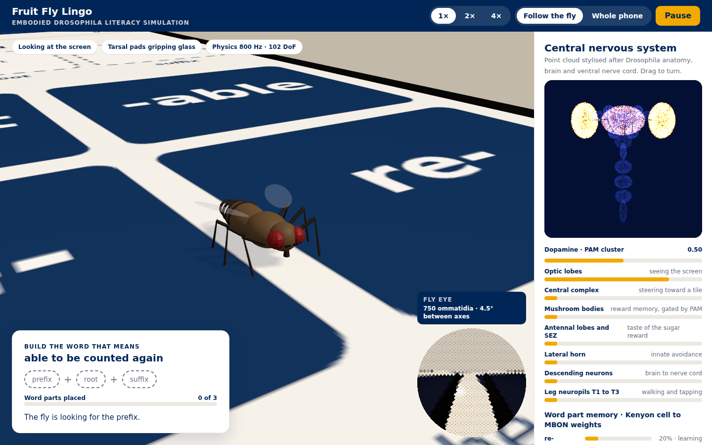

## Running it

Serve the folder over HTTP and open `index.html`. ES modules and three.js load from jsdelivr, so it needs a server and network access, but no build step.

```
python3 -m http.server 8000
# then open http://localhost:8000/index.html
```

### Deploying on Vercel

The repository is a static site, so it deploys as is: import it at [vercel.com/new](https://vercel.com/new), leave the framework preset on "Other" with no build command and the output directory at the repository root, and deploy. `vercel.json` sets caching for the research PDFs and screenshots. Or use the button:

[](https://vercel.com/new/clone?repository-url=https%3A%2F%2Fgithub.com%2Fjayrosen-design%2Ffly-lingo)

From a terminal with the Vercel CLI, `npx vercel` from the repository root does the same.

## Three views

The app is one page with three views, switched by the tabs in the header and by hash routes (`#simulate`, `#dashboards`, `#about`). It works at phone width: the header controls become a scrollable strip, the brain panel docks under the arena, and the dashboards stack to one column.

| | |
| --- | --- |
| 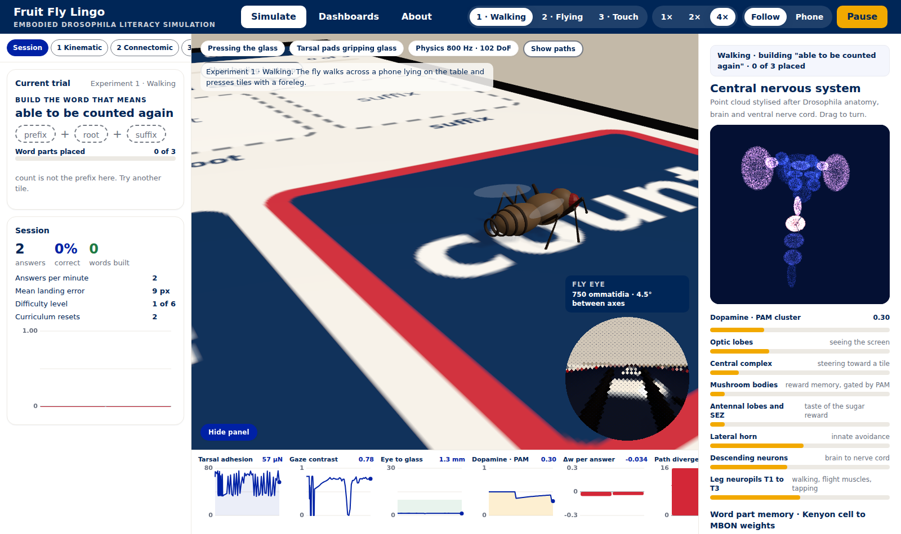 | 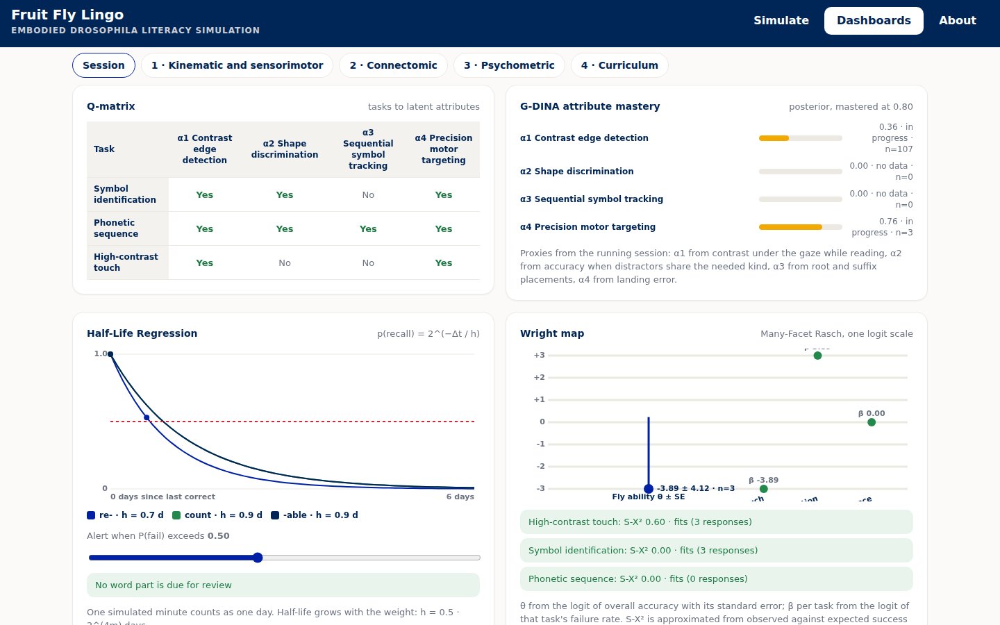 |
| **Simulate.** The arena with the fly-eye inset, the brain panel on the right, a dockable dashboard panel on the left (switch between Session and the four dashboards with the buttons at its top, or hide it), and a bottom strip of always-on live charts: adhesion, gaze contrast, eye-to-glass distance, dopamine, Δw per answer and path divergence. | **Dashboards.** Four dashboards from the EDLS psychometric specification, fed by telemetry from the running simulation. |
| 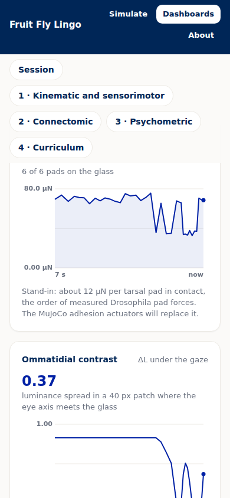 | 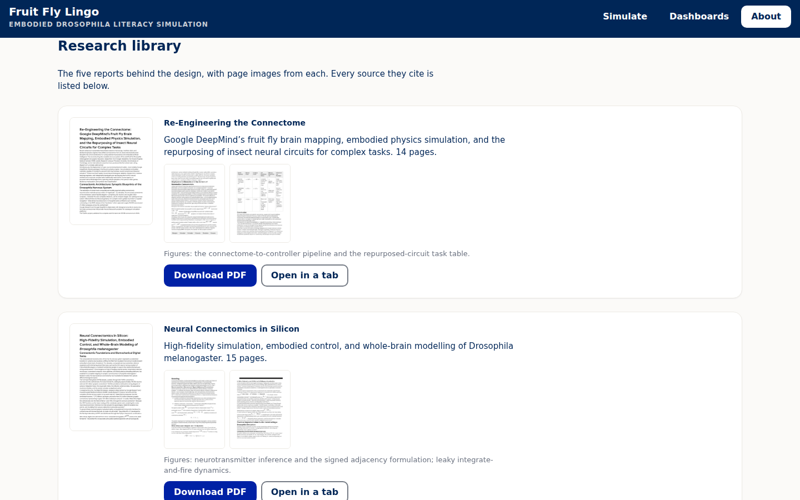 |
| **Phone layout.** Single-column cards, header controls in a strip. | **About.** What the app simulates and what it is trying to learn, the research library with downloadable PDFs and page images, and all 187 sources the reports cite. |

### The dashboards

Everything is computed from the live session. Where a quantity stands in for a sensor or model the app does not yet have, the card says so.

1. **Kinematic and sensorimotor.** Tarsal adhesion (pads in contact, about 12 µN each), ommatidial contrast sampled from the real screen texture where the head camera's axis meets the glass, a joint-torque proxy from foot speeds, the microsaccadic gaze path drawn on a miniature screen, and viewing distance against the 1 to 10 mm acuity band with an acuity heatmap of where the fly looked while inside it.
2. **Connectomic and neurophysiological.** Live afferent, intrinsic and efferent activity as a directed graph coloured by neurotransmitter class; the PAM rule Δw = η(R − V) per answer, which is now the rule the fly's memory actually uses; short-term versus long-term memory traces; and a region-to-region connectivity matrix with a MaleCNS v1.0 / FlyWire FAFB toggle (the FAFB view greys out the nerve-cord rows the dataset lacks).
3. **Psychometric and cognitive diagnosis.** The Q-matrix from the specification, G-DINA attribute posteriors from session proxies, Half-Life Regression forgetting curves per word part with a configurable P(fail) alert, and a Wright map with the fly's ability θ and its standard error against task difficulties, plus an S-X² misfit flag at 1.5.
4. **Curriculum adaptation.** A toy mLSTM cell running the specification's stabilised update on keys from the fly's sensory stream (C_t heat grid, m_t and n_t traces), and the Decision Transformer panel: return-to-go target, difficulty level, and path divergence between the fly's actual path and a ghosted optimal path to the correct tile, which resets the curriculum a level when it exceeds 10. Difficulty changes the distractors: from level 3 they share the needed part's kind.

## Experiment 1 in detail

| | |
| --- | --- |
| 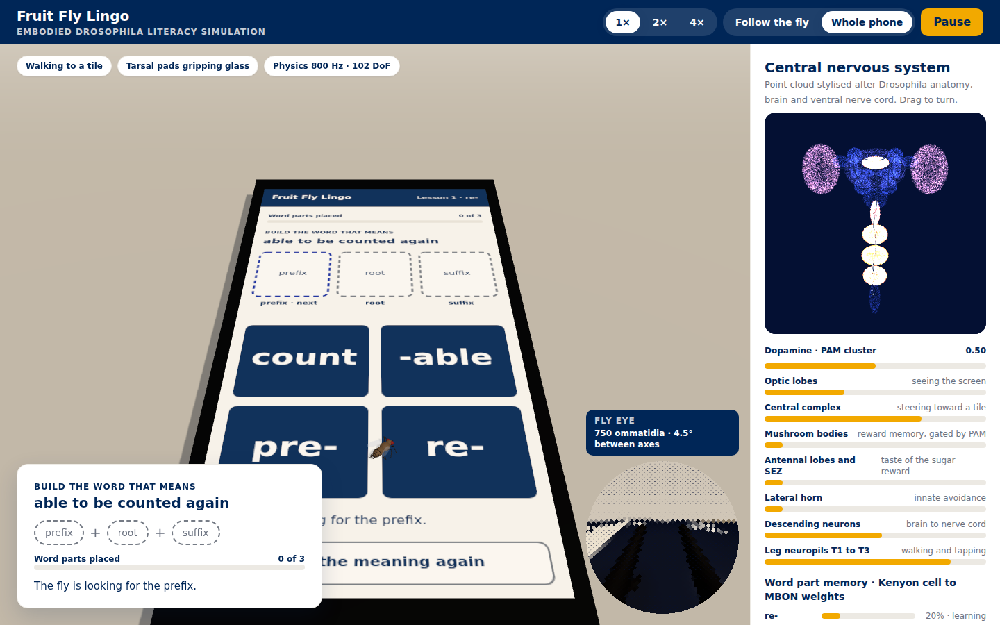 | 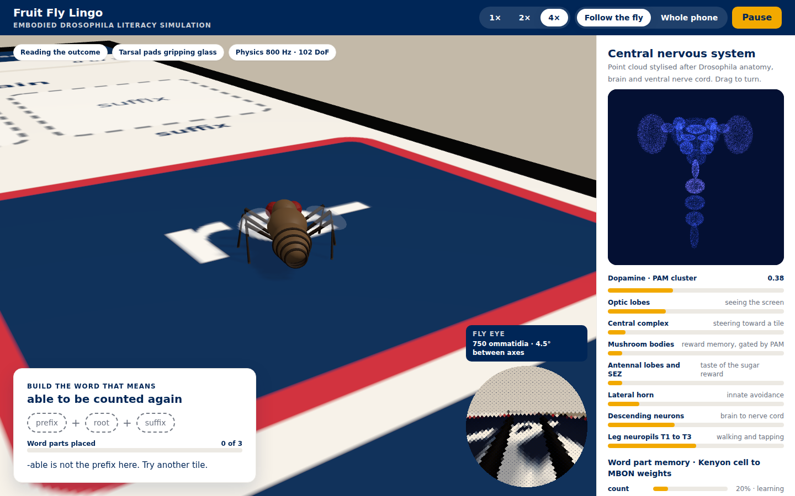 |
| **Whole phone.** The lesson screen is a canvas texture: progress, the meaning to build, three slots, four tiles, a feedback line. Tile pixel rectangles map to world coordinates the fly walks to. | **A wrong tap.** The tile flashes red, the lateral horn and descending neurons fire, the fly flinches, dopamine drops and that word part's memory weakens slightly. |
| 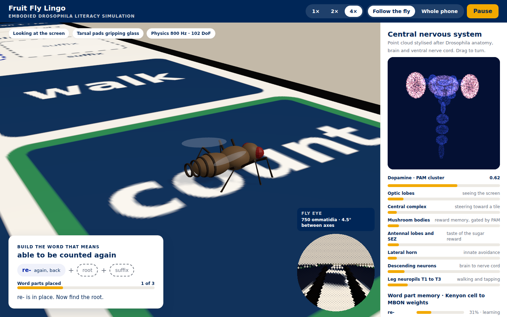 | 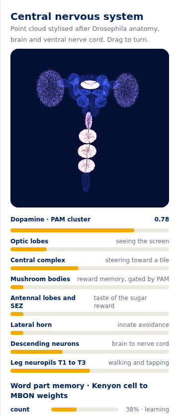 |
| **A correct tap.** `re-` fills the prefix slot, the mushroom bodies and taste centres fire, dopamine rises, the wings buzz, the proboscis extends, and the memory of `re-` strengthens. | **The brain panel.** About 55,000 points in blobs placed after Drosophila anatomy, fibre tracts with travelling pulses, a dopamine meter, per-region activity and per-morpheme memory. Drag to turn it. |

The round inset at the bottom right is the **fly-eye view**: a camera mounted on the fly's head, rendered through a hexagonal ommatidia mosaic (about 750 cells, matching the 4.5° inter-ommatidial angle in the TRD). Letters blur into luminance blocks, which is why the fly has to sweep its head to resolve them.

### Controls

- Experiment: 1 Walking, 2 Flying, 3 Touch.
- Show paths / Show landing heatmap: toggles above the arena, kept per experiment.
- Speed 1×, 2×, 4×.
- Camera: follow the fly, or view the whole phone. Drag to orbit, scroll to zoom.
- Pause / Play.
- Reset memory: clears the Kenyon cell to MBON weights and restarts the curriculum.


## The experiments

Switch with the control at the top left of the header. All three share the same curriculum, memory, brain model and fly; what changes is how the fly reaches the screen and what the phone is.

| | |
| --- | --- |
| 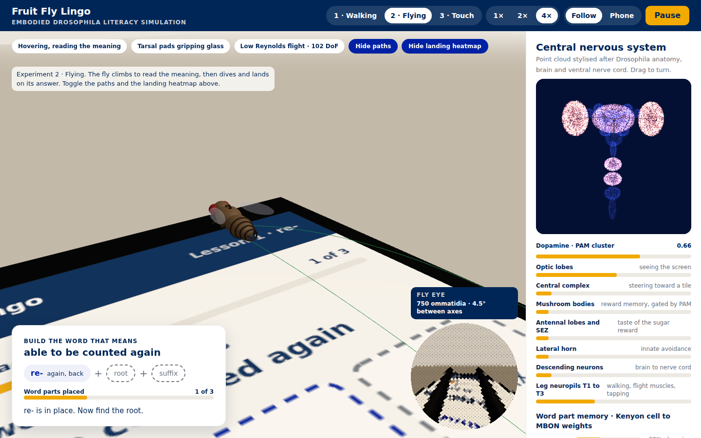 | 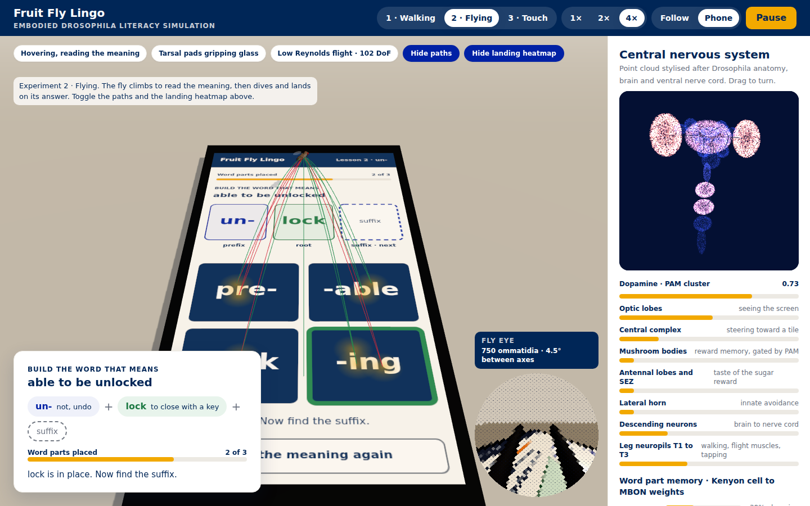 |
| **Experiment 2 · Flying, in the air.** The fly takes off, climbs to a hover point above the meaning and slots, and reads with a head sweep. Wings buzz, legs tuck, the body pitches with the dive. | **Paths and landing heatmap.** Each flight is traced from take-off to landing, green for a correct landing and red for a wrong one. Landings also accumulate as amber heat on the screen, so the distribution of where the fly puts down builds up over trials. Both are toggles above the arena. |
| 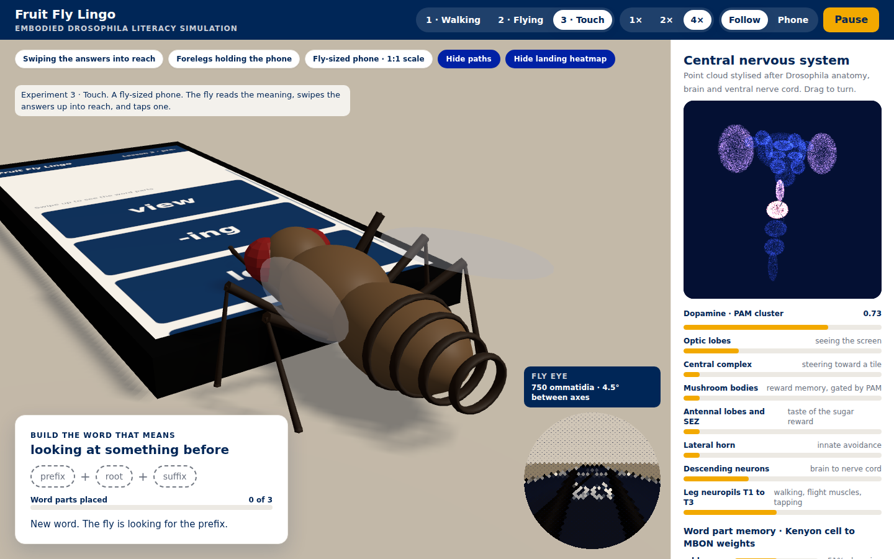 | 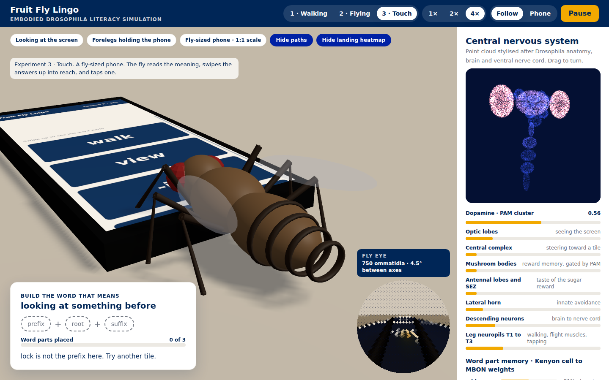 |
| **Experiment 3 · Touch, swiping.** The phone is scaled to the fly (about 1.6 body lengths long). The fly stands at the bottom edge with its forelegs on the glass, the way a person holds a phone. The answers are a single column below the fold, so it reads the meaning at the top, then swipes up with a foreleg to scroll them into reach. | **Tapping.** Once the chosen tile sits under its reach it presses with the nearer foreleg. The scroll position is part of the coordinate mapping, so the tap lands on the tile where it is currently drawn. |

| Experiment | Phone | Reading | Answering | Records |
| --- | --- | --- | --- | --- |
| 1 · Walking | Table-sized, lying flat | Head sweep from where it stands | Walks to the tile, presses with a foreleg | Walking paths, press heatmap |
| 2 · Flying | Table-sized, lying flat | Climbs to a hover point over the prompt | Dives and lands on the tile; landing is the answer | Flight paths, landing heatmap |
| 3 · Touch | Fly-sized, held at the bottom edge | Reads at scroll 0 | Swipes the list, then taps | Press heatmap in content coordinates |
| 4 · Spelling | Real-size laptop with a spelling activity | Hovers in front of the screen | Flies key to key and presses each letter with its body | Letter answers into the same trials, memory and dashboards |
| 5 · Teacher | Fly-sized laptop with a gradebook, trackpad only, no touch | Reads from the trackpad | Steers the cursor with one foreleg on the pad, presses the pad to click, steps over to tap keys | Clicks, misclicks, keystrokes, Fitts' law, cursor heatmap, grading error |
| 6 · District admin | Fly-sized laptop with nine webcam sessions, a vision overlay and FlyAI | Watches the grid | Steers to a flagged tile, opens it, clicks the check-in button | Flags scored against seeded cheating, precision, response time, attention, detections |

### Spelling

Experiment 4 is a fourth literacy activity. The real-size laptop shows the meaning to spell and the three word-part hints with their glosses, then a row of letter boxes underlined by part. The fly hovers in front of the screen to read, then flies to the key for the next letter and presses it with its whole body. The chance of the right key grows with the memory of the word part the letter belongs to; a wrong choice lands on a neighbouring key, flashes red, and counts as a wrong answer. Each letter is a trial like a tile press, so it feeds the same memory rule, dashboards, and the teacher's roster, where the speller is Fly D.

### Teacher

Experiment 5 turns the study on itself. A teacher fly sits at a fly-sized laptop (smaller than the phone in Experiment 3) running a small learning-management gradebook whose students are Fly A, B, C and D: the walking, flying, touch and spelling flies from Experiments 1 to 4. Their rows are this session's real trials (answers, accuracy, words built, word-part memory), so what the teacher reads is the ongoing study. For each student the teacher reads the gradebook, opens the row, reads the detail page, clicks the grade field, types a grade equal to what it believes the student's accuracy is (it misreads digits less as it practises), presses Enter and clicks Submit; a student with no submission yet is marked Incomplete. When all four are graded a new grading period opens.

The screen is never touched and there is no mouse. The teacher parks at the back of the trackpad and steers the cursor with one foreleg inside a reach window that maps onto the whole screen, so the entire trackpad is covered by moving one leg; a press of the pad is a click, and the movement time of each steer follows the target's index of difficulty. It leaves the pad only to step over to a key, tap it, and walk back.

| | |
| --- | --- |
| 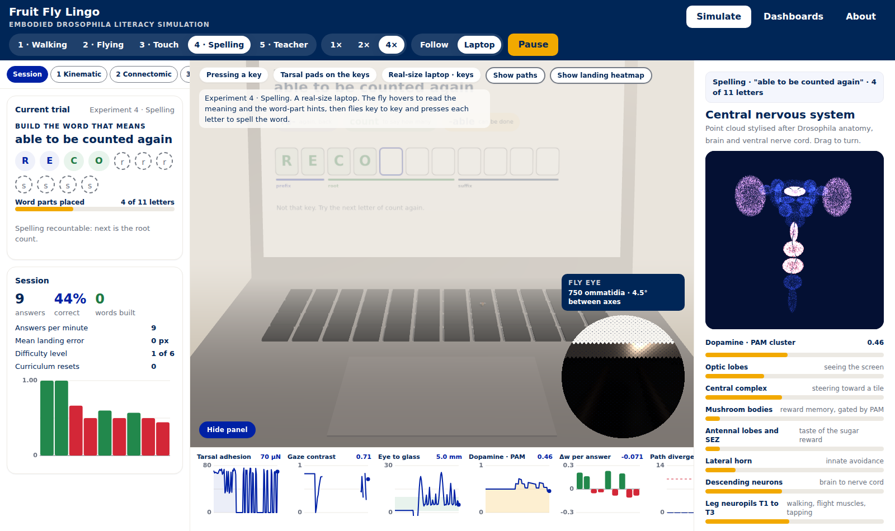 | 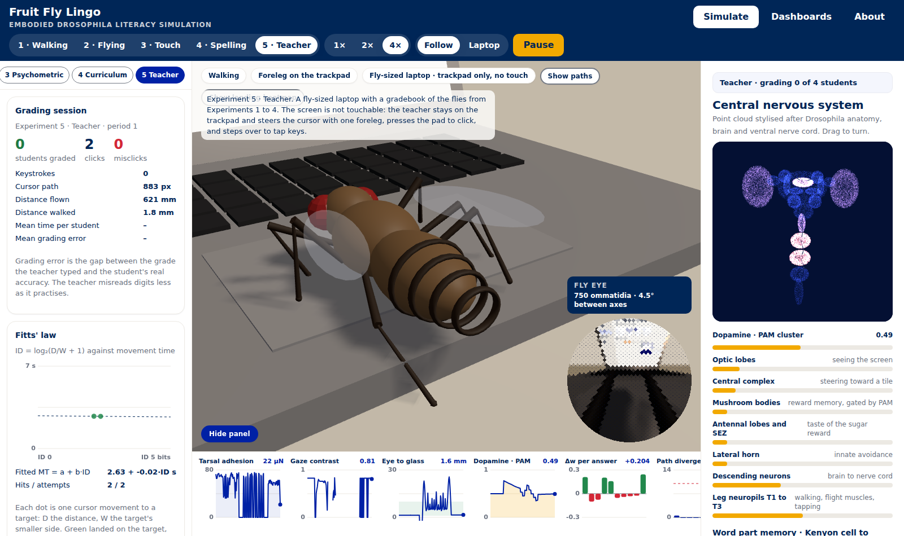 |
| **Experiment 4.** Real-size laptop; the speller on a key with the hints and letter boxes on screen. | **Experiment 5.** Fly-sized laptop; the teacher parked at the back of the trackpad, steering with a foreleg. |

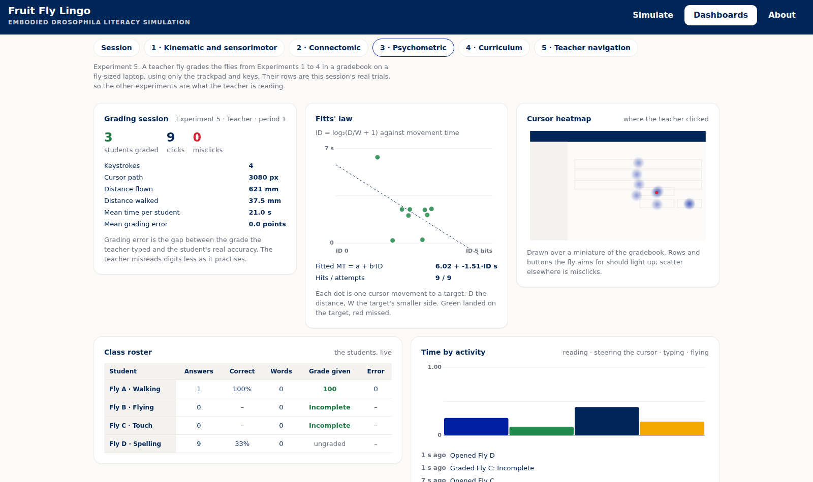

Dashboard 5, Teacher navigation, measures how it navigates: clicks and misclicks (a miss replans), keystrokes, cursor path length, distance flown and walked, time per student, grading error against the student's real accuracy, a Fitts' law scatter of index of difficulty against movement time with a fitted line, a click heatmap over a miniature of the gradebook, the live class roster, and time split between reading, steering, typing and flying.

### District admin

Experiment 6 puts an admin fly at the same fly-sized laptop, trackpad only, in front of a proctoring screen: a 3 × 3 grid of webcam sessions, three each of walking, flying and touch students, each a lightweight simulation with its own phone, answers and behaviour. Three of the nine are seeded each session with a cheating behaviour: looking away from the task, a helper fly in frame, a second device, or answering while off camera. Honest students still glance away now and then.

A computer-vision overlay runs on every tile: a bounding box on the fly with a confidence score, boxes on both forelegs labelled hands, and a dashed gaze ray with an eye-contact badge that turns red when the gaze leaves the student's own screen, plus badges for a second fly, a second device or an off-camera fly. FlyAI, a rule-based assistant in a chat panel, reads that evidence and posts flags with the student's attention and accuracy and a recommendation. The admin watches the grid, steers the cursor to a flagged tile, opens it, and clicks the check-in button; a check-in stops the behaviour for a while.

Dashboard 6, District proctoring, scores the flags against the hidden seeding: confirmed flags and false alarms, precision, cheaters caught, response time from flag to check-in, attention per student (with the seeded names marked in red, which the admin never sees), detection counts over time, and the FlyAI log.

| | |
| --- | --- |
| 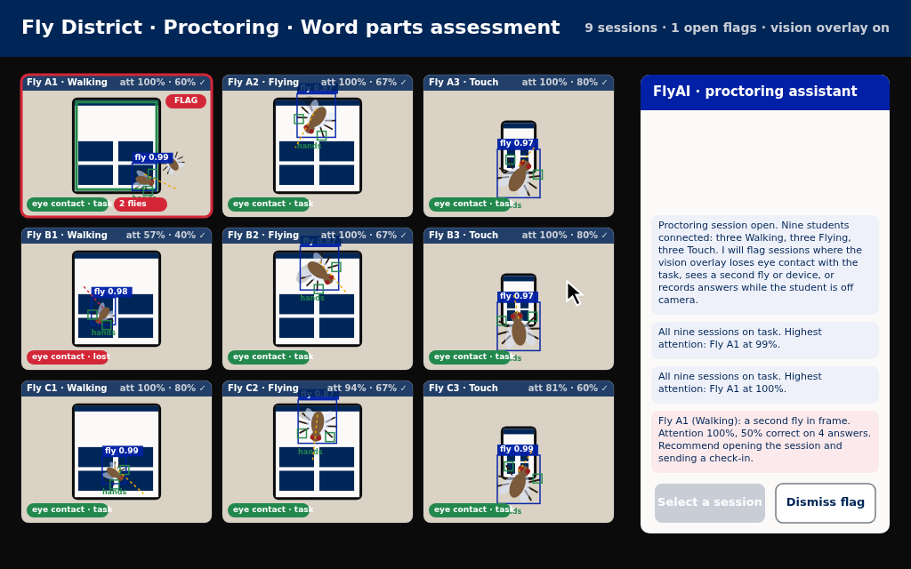 | 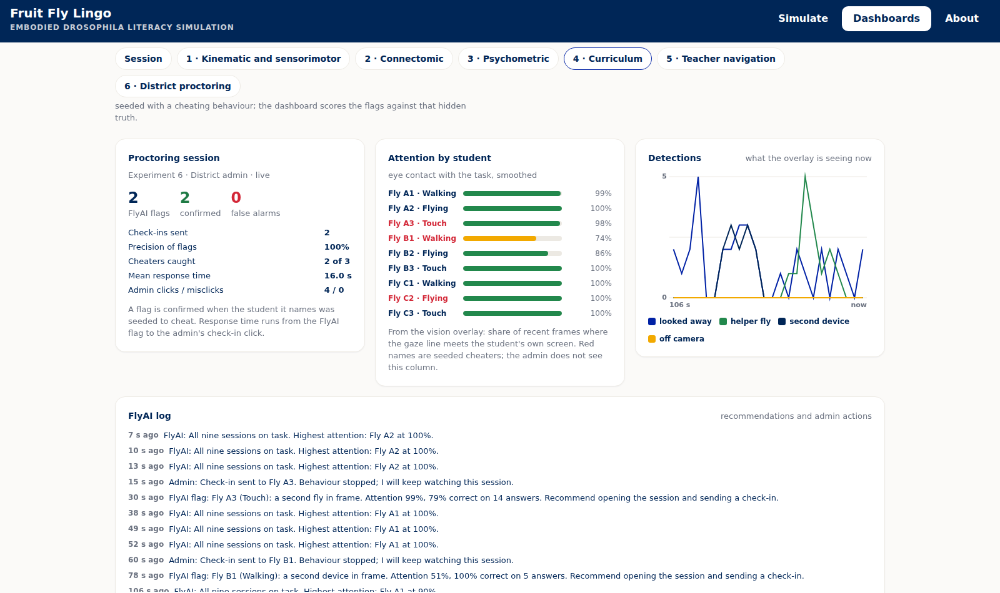 |
| **The proctoring screen.** Boxes on flies and hands, gaze rays, eye-contact badges, a red flag on a suspected tile, FlyAI on the right. | **Dashboard 6.** Flags scored against the seeded truth, attention per student, detections over time. |

The landing scatter is deliberate: each answer is aimed at the tile centre plus a small normal error (about 6 px walking, 14 px flying, 8 px touch on the 390 px wide screen), which is what makes the heatmap informative rather than a set of points.

## Software architecture

The whole application lives in `index.html`. The diagram groups it by responsibility; arrows are data or control flow at run time.


```mermaid
flowchart TB
  subgraph Browser["Browser · index.html"]
    direction TB

    subgraph UI["HUD · HTML + CSS (UF design tokens)"]
      Header["Header controls<br/>experiment · speed · camera · pause"]
      TrialCard["Trial card<br/>meaning · placed chips · progress · feedback"]
      StatePills["State pills<br/>phase · adhesion · physics"]
      BrainHUD["Brain panel HUD<br/>dopamine · region bars · memory · stats"]
      EyeLabel["Fly-eye label"]
    end

    subgraph Game["Curriculum and game state"]
      WORDS["WORDS[]<br/>word · meaning · parts · glosses"]
      Distractors["DISTRACTORS[]"]
      GameState["game<br/>wordIdx · placed · tiles · flash<br/>memory Map · dopamine · taps · correct"]
      buildTiles["buildTiles()<br/>remaining parts + distractors, shuffled"]
      registerTap["registerTap(i)<br/>correct → memory↑ dopamine↑ placed++<br/>wrong → memory↓ dopamine↓ flinch"]
      nextWord["nextWord()"]
    end

    subgraph Screen["Phone screen"]
      ScreenCanvas["2D canvas 390×844<br/>drawScreen(): grid layout, or scrolling list for Touch"]
      ScreenTex["THREE.CanvasTexture<br/>map + emissiveMap on the screen plane"]
      pxToWorld["pxToWorld(px, py)<br/>content px → phone local → world, through phone scale"]
    end

    subgraph Agent["Agent · state machine (stepAgent), one path per experiment"]
      Look["look<br/>head sweep · optic lobes"]
      Walk["1 walk<br/>steer to stand point · gait · CX, DN, T1–T3"]
      Takeoff["2 takeoff → hover<br/>climb over the prompt, read"]
      Dive["2 dive → land<br/>bezier to the tile, landing = answer"]
      Scroll["3 scroll<br/>foreleg swipes move scrollY"]
      Tap["tap<br/>foreleg reach · press · return"]
      React["react"]
      Celebrate["celebrate<br/>word complete"]
      chooseTile["chooseTile()<br/>P(correct) = 0.35 + 0.6 · memory"]
      pickTarget["pickTarget()<br/>tile centre + normal scatter"]
      Look --> Walk --> Tap
      Look --> Takeoff --> Dive --> React
      Look --> Scroll --> Tap
      Tap --> React --> Look
      Tap --> Celebrate --> Look
      Dive --> Celebrate
    end

    subgraph Records["Trajectories and heatmap"]
      Traj["trajGroups[exp]<br/>THREE.Line per trial, green or red"]
      Heat["heat[exp] canvas<br/>radial blobs at landing px, drawn into the screen"]
      Toggles["Show paths · Show landing heatmap"]
    end

    subgraph Fly["Procedural fly (animateFly)"]
      Body["body group<br/>thorax · abdomen · head · eyes · antennae"]
      Wings["wings<br/>buzz on reward"]
      Proboscis["proboscis<br/>extends on reward"]
      Legs["6 legs · femur + tibia<br/>world-space feet · tripod stepping"]
      IK["solveLeg()<br/>two-bone analytic IK"]
      FlyState["flyState<br/>pos · yaw · headYaw · buzz · flinch · gaitPhase"]
    end

    subgraph Brain["Brain activity model"]
      Regions["REGIONS[16]<br/>optic L/R · central · MB L/R · CX · AL L/R<br/>LH L/R · SEZ · DN · T1 · T2 · T3 · ABD"]
      Act["act[16] Float32Array<br/>pulse(i, v) · exponential decay"]
      PointCloud["Points ~55k<br/>ShaderMaterial: region → act[] → colour, size"]
      Fibres["FIBRES[14] CatmullRom tracts<br/>pulse particles gated by source activity"]
      Groups["GROUPS[7]<br/>anatomical labels for the HUD"]
    end

    subgraph Render["Rendering · three.js r160"]
      MainScene["Main scene<br/>table · phone · glass · fly · lights · shadows"]
      MainCam["Perspective camera + OrbitControls<br/>follow / phone modes"]
      EyeCam["Eye camera on the head<br/>fov 140"]
      EyeRT["WebGLRenderTarget 256²"]
      EyeShader["Ommatidia shader quad<br/>hex nearest-centre sampling"]
      BrainScene["Brain scene · second renderer<br/>OrbitControls autoRotate"]
      Loop["frame()<br/>dt = raw · speed, substepped at 25 ms"]
    end
  end

  CDN["cdn.jsdelivr.net<br/>three.module.js · OrbitControls.js"] -.import map.-> Render

  Header -->|speed, camera, play| Loop
  Header -->|set camera mode| MainCam
  BrainHUD -->|reset| GameState

  WORDS --> buildTiles --> GameState
  Distractors --> buildTiles
  GameState --> ScreenCanvas --> ScreenTex --> MainScene
  GameState --> TrialCard
  GameState --> BrainHUD

  Loop --> Agent
  Loop --> Fly
  Loop -->|decay| Act
  Loop --> MainCam
  chooseTile --> pickTarget
  GameState --> chooseTile
  pickTarget --> pxToWorld
  pxToWorld --> FlyState
  Walk -->|record positions| Traj
  Dive -->|record positions| Traj
  registerTap -->|landing px| Heat
  Heat --> ScreenCanvas
  Toggles --> Traj
  Toggles --> Heat
  Traj --> MainScene
  Agent -->|pulse| Act
  Agent -->|phase| StatePills
  Tap -->|foot reaches tile| Legs
  Tap --> registerTap --> GameState
  registerTap -->|pulse| Act
  registerTap -->|buzz, proboscis, flinch| FlyState
  Celebrate --> nextWord --> GameState

  FlyState --> Body
  FlyState --> Wings
  FlyState --> Proboscis
  Legs --> IK --> MainScene
  Body --> EyeCam

  Regions --> PointCloud
  Regions --> Fibres
  Act --> PointCloud
  Act --> Fibres
  Act --> Groups --> BrainHUD
  PointCloud --> BrainScene
  Fibres --> BrainScene

  MainScene --> MainCam --> Loop
  MainScene --> EyeCam --> EyeRT --> EyeShader -->|scissor viewport| Loop
  BrainScene --> Loop
```

### Agent state machine

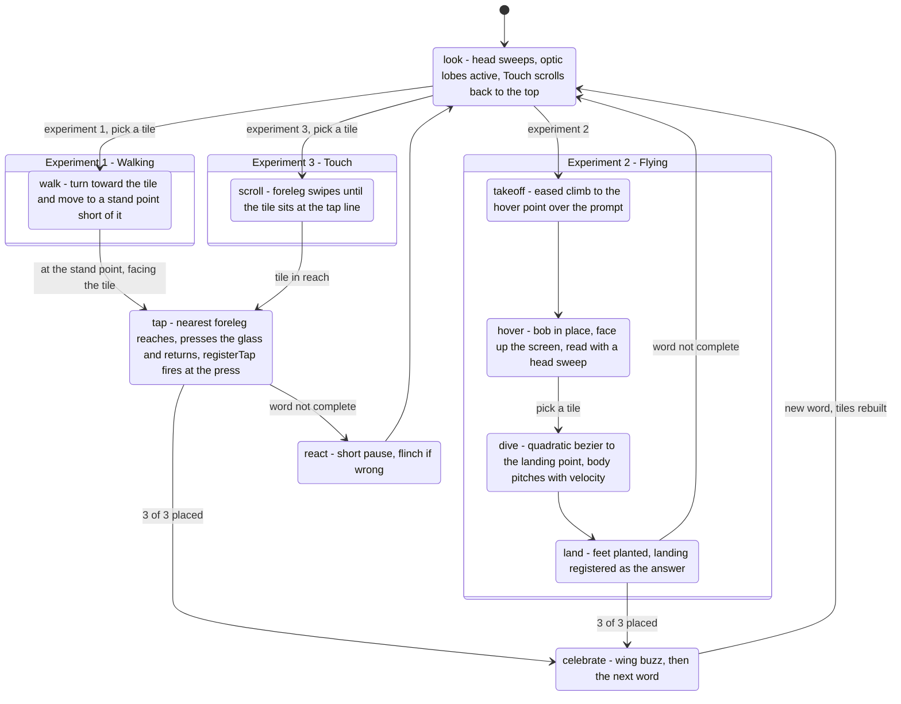
```mermaid
stateDiagram-v2
  [*] --> look
  look: look - head sweeps, optic lobes active, Touch scrolls back to the top
  state "Experiment 1 - Walking" as E1 {
    walk: walk - turn toward the tile and move to a stand point short of it
  }
  state "Experiment 2 - Flying" as E2 {
    takeoff: takeoff - eased climb to the hover point over the prompt
    hover: hover - bob in place, face up the screen, read with a head sweep
    dive: dive - quadratic bezier to the landing point, body pitches with velocity
    land: land - feet planted, landing registered as the answer
    takeoff --> hover
    hover --> dive: pick a tile
    dive --> land
  }
  state "Experiment 3 - Touch" as E3 {
    scroll: scroll - foreleg swipes until the tile sits at the tap line
  }
  tap: tap - nearest foreleg reaches, presses the glass and returns, registerTap fires at the press
  react: react - short pause, flinch if wrong
  celebrate: celebrate - wing buzz, then the next word

  look --> walk: experiment 1, pick a tile
  look --> takeoff: experiment 2
  look --> scroll: experiment 3, pick a tile
  walk --> tap: at the stand point, facing the tile
  scroll --> tap: tile in reach
  tap --> react: word not complete
  tap --> celebrate: 3 of 3 placed
  land --> look: word not complete
  land --> celebrate: 3 of 3 placed
  react --> look
  celebrate --> look: new word, tiles rebuilt
```

### One answer, end to end (Experiment 1 shown; a landing in Experiment 2 and a tap in Experiment 3 join at registerTap)

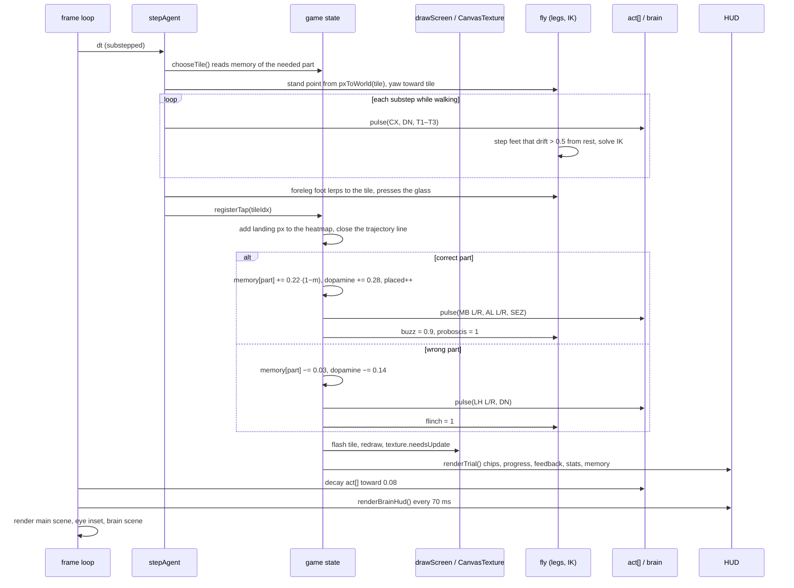
```mermaid
sequenceDiagram
  participant L as frame loop
  participant A as stepAgent
  participant G as game state
  participant S as drawScreen / CanvasTexture
  participant F as fly (legs, IK)
  participant B as act[] / brain
  participant H as HUD

  L->>A: dt (substepped)
  A->>G: chooseTile() reads memory of the needed part
  A->>F: stand point from pxToWorld(tile), yaw toward tile
  loop each substep while walking
    A->>B: pulse(CX, DN, T1–T3)
    F->>F: step feet that drift > 0.5 from rest, solve IK
  end
  A->>F: foreleg foot lerps to the tile, presses the glass
  A->>G: registerTap(tileIdx)
  G->>G: add landing px to the heatmap, close the trajectory line
  alt correct part
    G->>G: memory[part] += 0.22·(1−m), dopamine += 0.28, placed++
    G->>B: pulse(MB L/R, AL L/R, SEZ)
    G->>F: buzz = 0.9, proboscis = 1
  else wrong part
    G->>G: memory[part] −= 0.03, dopamine −= 0.14
    G->>B: pulse(LH L/R, DN)
    G->>F: flinch = 1
  end
  G->>S: flash tile, redraw, texture.needsUpdate
  G->>H: renderTrial() chips, progress, feedback, stats, memory
  L->>B: decay act[] toward 0.08
  L->>H: renderBrainHud() every 70 ms
  L->>L: render main scene, eye inset, brain scene
```

## Where this sits in the EDLS

The TRD describes a biologically grounded stack: a MuJoCo `flybody` model (102 DoF, 59 torque channels) driven by a connectome-derived controller (FlyGM on MaleCNS v1.0), with xAPI telemetry flowing through a Science DMZ to a Learning Record Store for G-DINA, Half-Life Regression and Rasch evaluation. This repository implements the interaction layer and a behavioural stand-in for the rest, so the game, camera work, fly-eye optics and brain visualisation can be designed and tested before the heavy components exist.

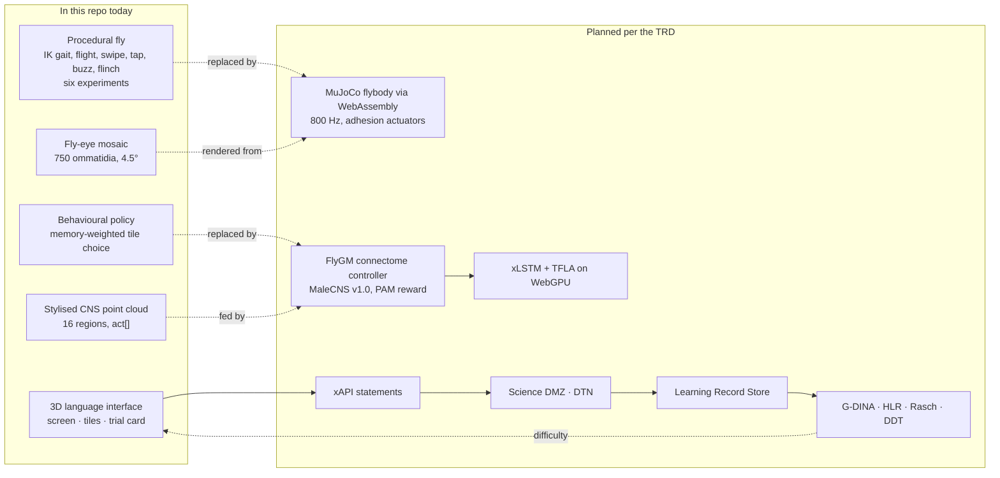
```mermaid
flowchart LR
  subgraph Now["In this repo today"]
    UI["3D language interface<br/>screen · tiles · trial card"]
    FlyP["Procedural fly<br/>IK gait, flight, swipe, tap, buzz, flinch<br/>six experiments"]
    Policy["Behavioural policy<br/>memory-weighted tile choice"]
    BrainViz["Stylised CNS point cloud<br/>16 regions, act[]"]
    Eye["Fly-eye mosaic<br/>750 ommatidia, 4.5°"]
  end
  subgraph Planned["Planned per the TRD"]
    MuJoCo["MuJoCo flybody via WebAssembly<br/>800 Hz, adhesion actuators"]
    FlyGM["FlyGM connectome controller<br/>MaleCNS v1.0, PAM reward"]
    xLSTM["xLSTM + TFLA on WebGPU"]
    xAPI["xAPI statements"]
    DMZ["Science DMZ · DTN"]
    LRS["Learning Record Store"]
    Eval["G-DINA · HLR · Rasch · DDT"]
  end
  Policy -. replaced by .-> FlyGM
  FlyP -. replaced by .-> MuJoCo
  BrainViz -. fed by .-> FlyGM
  Eye -. rendered from .-> MuJoCo
  UI --> xAPI --> DMZ --> LRS --> Eval
  Eval -. difficulty .-> UI
  FlyGM --> xLSTM
```

## Design system

Styling uses a University of Florida palette: core blue for actions, dark blue for chrome and text, alachua for work in flight, gator green for mastery, and bottlebrush red only for errors. Headings and controls are set in Neulis Sans and running text in Liebling, both with system fallbacks. The phone screen, the laptop screens and the HUD share the same tokens.

## Files

```
index.html            the whole app: three views, three.js scene, agent, brain, telemetry, dashboards, about
vercel.json           static deployment settings
README.md
docs/screenshots/     images used above
docs/research/        the five research PDFs, the dashboard specification, and rendered page images
```
