# Fruit Fly Lingo

A browser simulation of a fruit fly learning to build words. A procedural three.js fly reads a prefix + root + suffix task off a smartphone screen and answers by touching word-part tiles or typing letters, in four student experiments: walking across the phone, flying up to read and diving down to land on its answer, holding a fly-sized phone to swipe and tap, and spelling the word key by key on a laptop. Two more experiments put flies on the other side of the desk: a teacher grading those students from a fly-sized laptop, and a district admin proctoring nine webcam sessions with a vision overlay and an assistant called FlyAI. A side panel shows its central nervous system as a point cloud whose regions light up with what the fly is doing, and a dopamine reward signal that strengthens its memory of each word part.

It is the interactive front end of the Embodied Drosophila Literacy Simulation (EDLS) described in the project's technical requirement document. Everything here is procedural and runs client side in one HTML file; the connectome controller, MuJoCo body and telemetry pipeline from the TRD are the planned back end (see [Where this sits in the EDLS](#where-this-sits-in-the-edls)).

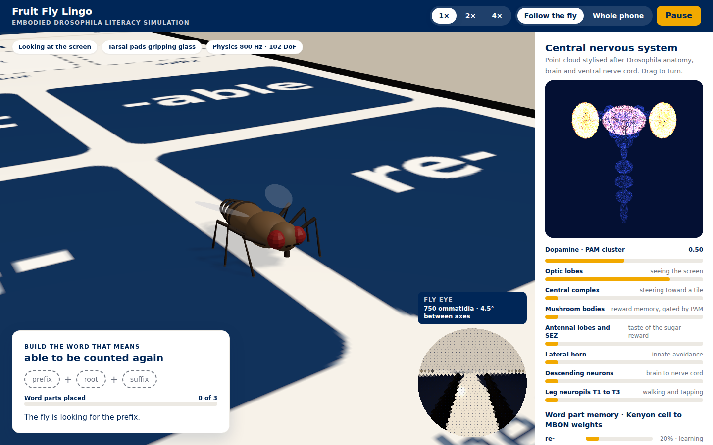

## Running it

Serve the folder over HTTP and open `index.html`. ES modules and three.js load from jsdelivr, so it needs a server and network access, but no build step.

```
python3 -m http.server 8000
# then open http://localhost:8000/index.html
```

### Deploying on Vercel

The repository is a static site, so it deploys as is: import it at [vercel.com/new](https://vercel.com/new), leave the framework preset on "Other" with no build command and the output directory at the repository root, and deploy. `vercel.json` sets caching for the research PDFs and screenshots. Or use the button:

[](https://vercel.com/new/clone?repository-url=https%3A%2F%2Fgithub.com%2Fjayrosen-design%2Ffly-lingo)

From a terminal with the Vercel CLI, `npx vercel` from the repository root does the same.

## Four views

The app is one page with four views, switched by the tabs in the header and by hash routes (`#home`, `#simulate`, `#dashboards`, `#about`). The home page explains the project and shows a card for each experiment; picking a card opens that experiment in the simulator.

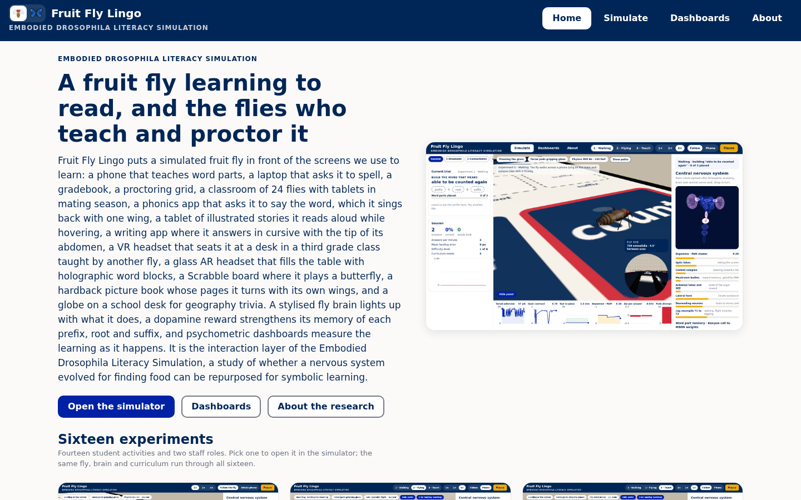 It works at phone width. The **Hide metrics / Show metrics** button in the arena hides every panel (the dashboard dock, the bottom strip and the scenario panel) so the 3D view fills the screen; phones start with the metrics hidden, and the choice is remembered. With metrics shown on a phone, the strip and the scenario panel sit under the arena, which keeps at least half the screen. The experiment list scrolls on its own line so speed, camera and Play stay in reach, the camera pulls back on a portrait screen, the fly-eye inset gives way on short screens, and a landscape phone shows only the arena. The dashboards stack to one column.

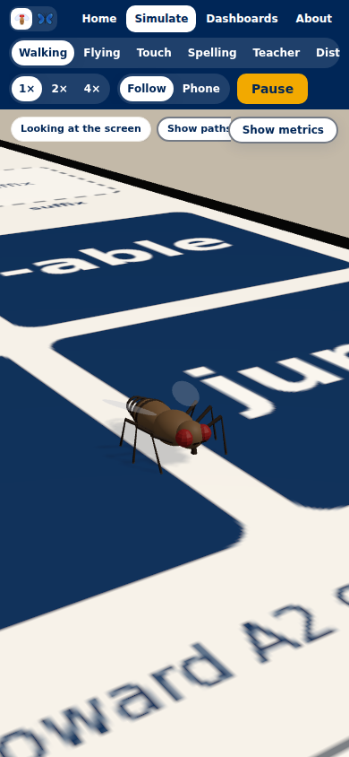

| | |
| --- | --- |
| 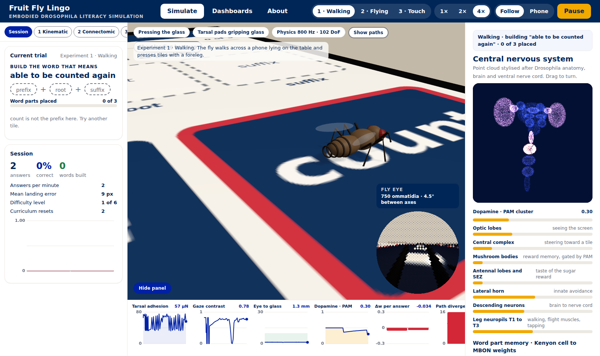 | 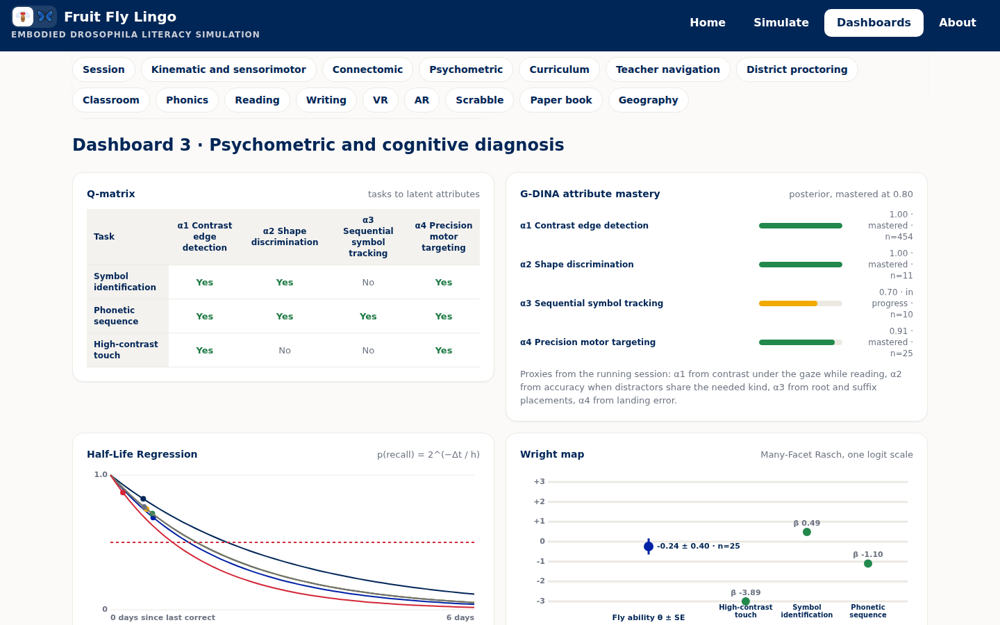 |
| **Simulate.** The arena with the fly-eye inset, a scenario panel on the right, an Experiment dropdown in the header, a dockable dashboard panel on the left that switches to the running experiment's dashboard (1 Kinematic, 2 Curriculum, 3 Psychometric, 4 Connectomic, 5 Teacher, 6 Admin, 7 Classroom, 8 Phonics, 9 Reading, 10 Writing, 11 VR, 12 AR, 13 Scrabble, 14 Paper book, 15 Geography; a green dot marks it; pick another with the buttons at its top, or hide it; its header names the dashboard and offers Notes for the explanatory text, Collapse all, and Full view, and each card folds by clicking its title), and a bottom strip of six live charts. The right panel and the strip also change with the experiment; see the table below. | **Dashboards.** Four dashboards from the EDLS psychometric specification, fed by telemetry from the running simulation. |
| 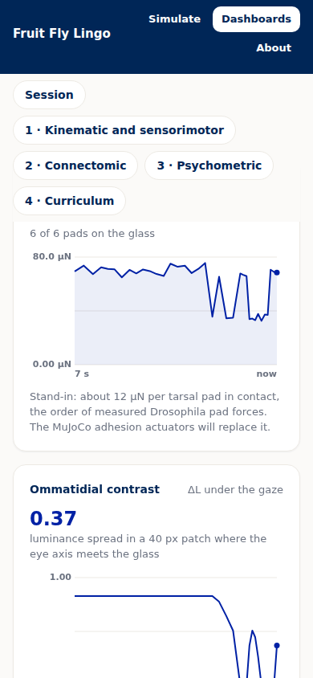 | 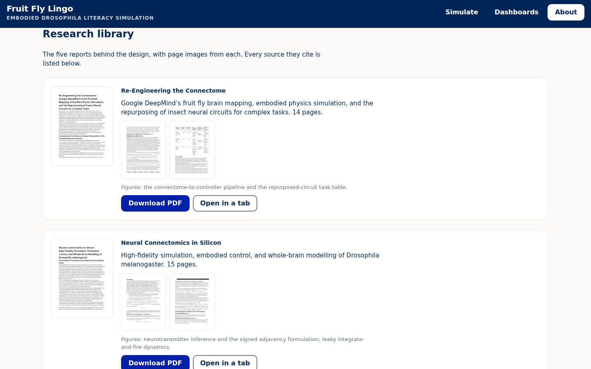 |
| **Phone layout.** Single-column cards, header controls in a strip. | **About.** What the app simulates and what it is trying to learn, the research library with downloadable PDFs and page images, and all 187 sources the reports cite. |

### Controls

The **Experiment** dropdown in the header lists all fifteen experiments in a vertical, scrollable menu (arrow keys, Home, End and Escape work). Camera views: **Follow** (third person), the experiment's device or scene view, and **On its back**, which rides just above the fly's or butterfly's thorax, looking forward over its head and eyes at what it is doing; in the classroom it rides on the followed fly. The **Hide fly-eye view** pill hides the compound-eye inset and is remembered. In butterfly mode a species picker beside the logos dresses every butterfly in every scene: Blue Morpho with the six Gainesville species mixed in the classroom (the default), or any one of Blue Morpho, Zebra Longwing, Gulf Fritillary, Monarch, Eastern Tiger Swallowtail, Cloudless Sulphur and Common Buckeye everywhere.

Rendering: the camera sees 6,000 units with fog from 700, the zoom-out limit is 1,400, and the near clipping plane follows the viewing distance so depth precision is not wasted; every screen, page, card and label drawn on a surface is pulled forward with a polygon offset, which removes the flicker where screens met their bodies. The fly's steps lift fast and set down softly, it rolls a little with the tripod gait, banks into turns in flight, draws its legs in on take-off, its antennae twitch and its abdomen breathes, and its beating wings blur. Its wings are shaped and sized like a *Drosophila* wing: as long as the body, hinged on the thorax, folded over the abdomen at rest and reaching just past its tip, clear with the costa, veins L2 to L5 and the two crossveins, and a faint iridescence; the body is slimmer to match.

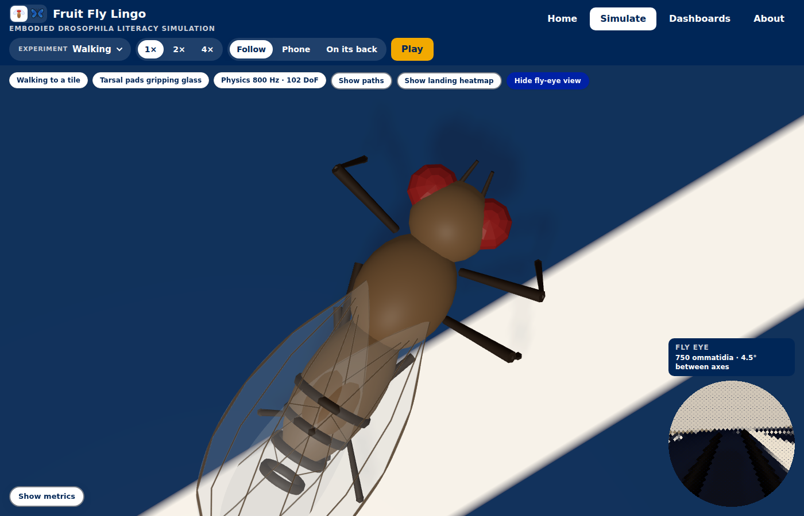

| | |
| --- | --- |
| 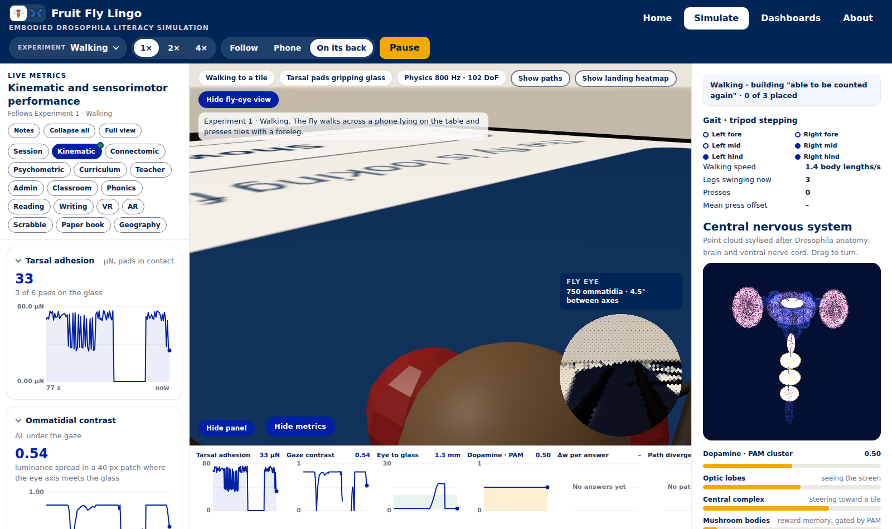 | 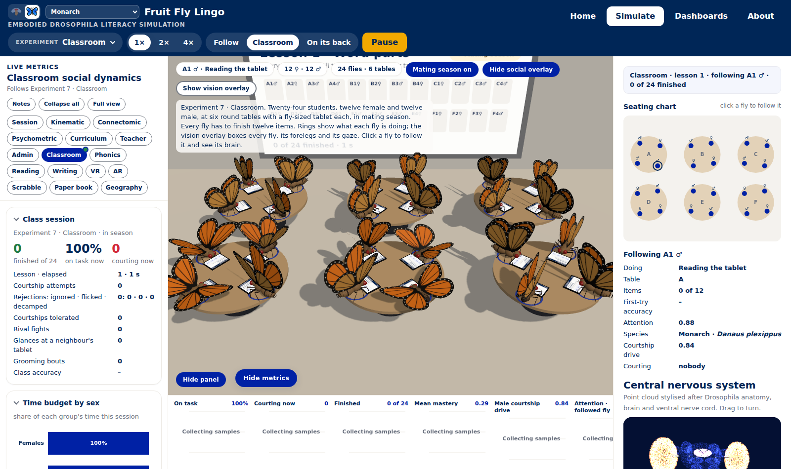 |
| **On its back.** Head and eyes in front, the task ahead. | **One species everywhere.** Monarch chosen from the picker. |

### Butterfly mode

The two logos at the left of the header switch the insect. The fruit fly is the default. In butterfly mode every fly in every experiment gets butterfly wings and a bigger body: the student and the VR teacher become Blue Morphos at 1.8 times the fly's size, iridescent blue on top with a black margin and white spots, brown with eyespots underneath. The 24 classroom flies, at 1.3 times, become six species common around Gainesville, Florida, four of each and mixed across the tables: Zebra Longwing (*Heliconius charithonia*, Florida's state butterfly), Gulf Fritillary (*Dione vanillae*), Monarch (*Danaus plexippus*), Eastern Tiger Swallowtail (*Papilio glaucus*), Cloudless Sulphur (*Phoebis sennae*) and Common Buckeye (*Junonia coenia*), each with its own wing shape and upper and under side patterns; the classroom card names the followed butterfly's species. The legs, brain and behaviour stay the same, but the wings change how it moves. At rest it holds them closed over its back, showing the brown undersides, and now and then opens them to bask. It flies with slow, deep strokes, about four a second instead of a fly's two hundred, bobbing up with each downstroke and weaving from side to side. In Phonics it sings by holding one blue wing open, and in the classroom its rejection flicks and threat displays open and close the big wings. The choice is remembered in the browser.

| | |
| --- | --- |
| 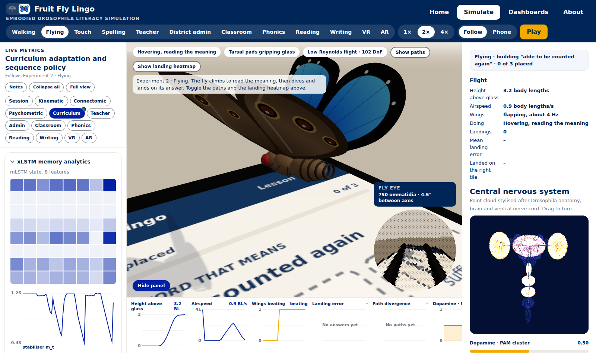 | 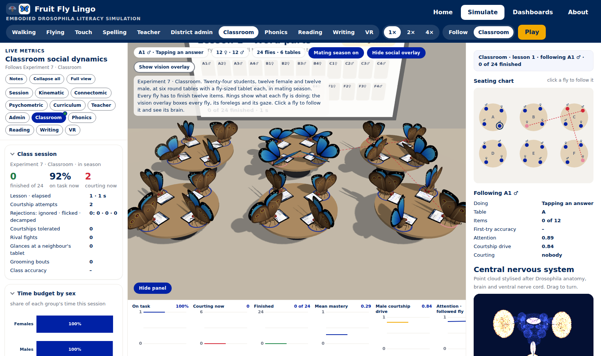 |
| **Flying.** Slow, deep wingbeats and a bobbing path. | **The classroom.** Six Gainesville species, wings closed at rest, opened to bask. |

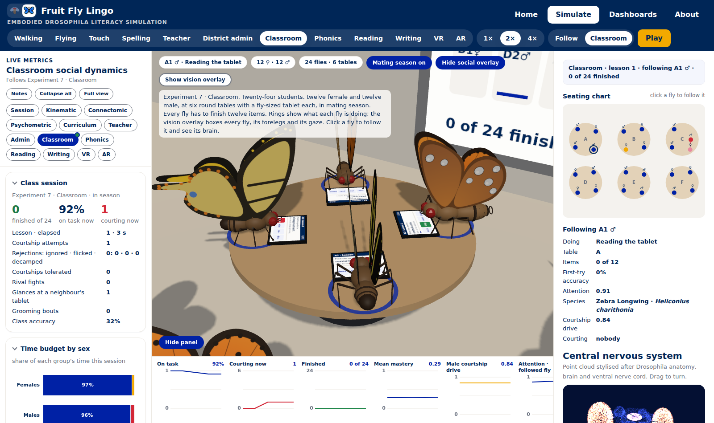

### Panels by experiment

The left panel docks the most related dashboard. The right panel and the bottom strip show what matters for the scenario in front of you, so the three together cover different ground instead of repeating the same numbers.

| Experiment | Right panel | Bottom strip |
| --- | --- | --- |
| 1 · Walking | Gait card (which of the six feet are down, walking speed, presses), brain, word-part memory | Adhesion, gaze contrast, eye to glass, dopamine, Δw per answer, path divergence |
| 2 · Flying | Flight card (height, airspeed, wings, landing error), brain, memory | Height above glass, airspeed, wings beating, landing error, path divergence, dopamine |
| 3 · Touch | Live copy of the fly-sized phone screen, touch card (scroll, forelegs, taps), brain, memory | Scroll position, gaze contrast, eye to glass, tap offset, Δw per answer, dopamine |
| 4 · Spelling | Live laptop screen, spelling card (letters so far, next part, key accuracy), brain, memory | Letters typed, keys right and wrong, flight speed, height above keys, Δw per letter, dopamine |
| 5 · Teacher | Live gradebook screen, grading queue, the teacher's next actions, cursor and foreleg state; no brain | Cursor path, clicks and misclicks, movement time, grading error, keystrokes, students graded |
| 6 · District admin | Live proctoring screen, open flags, FlyAI's latest recommendation, next actions; no brain | Mean attention, open flags, detections, flag precision, check-ins, response time |
| 15 · Geography | Live world map with the lit countries, geography card (question, country heading for, globe spin, last answer and distance off, round), brain, country memory | Height above the desk, globe spin, countries right, distance off, country memory, dopamine |
| 14 · Paper book | Live copy of the open spread, reading card (spread, word now, voice, page state while turning, last page's rate and accuracy, last page turn), brain, vocabulary memory | Reading voice, words per minute, height above the page, seconds to lift a page, reading accuracy, dopamine |
| 13 · Scrabble | Live scoreboard (board, both racks, scores, wins), Scrabble card (game, score, turn, word being played, last word, bag, words known), brain, words known by each player | Score over the game, points per word, tiles in the bag, words known by each player, fly walking speed, dopamine |
| 12 · AR | Mixed-reality card (word, next slot, block held, rotation to go, walking around a block, last block), brain, word part memory | Walking speed, holding a block, block rotation error, blocks right, word part memory, dopamine |
| 11 · VR | Live student headset view with the teacher's view as an inset, headset card (what is on the board, where the student looks, ball speed and distance, turns, pencil, last answer), brain, word part memory | Ball speed, where the student looks, pencil on the paper, answers right, word part memory, dopamine |
| 10 · Writing | Live copy of the writing app with the ink, writing card (question, progress, abdomen tip, pitch, motor skill, last answer), brain, Greek root memory | Abdomen tip on the glass, letters per minute, legibility, root memory, answers right, dopamine |
| 9 · Reading | Live copy of the storybook page, reading card (word now, voice, last page's rate and accuracy, hover height), brain, vocabulary memory | Reading voice, words per minute, reading accuracy, vocabulary memory, Stop & Think, dopamine |
| 8 · Phonics | Live copy of the phonics app, wing-song card (sound being sung, song mode, carrier pitch, wing), brain, letter-sound memory | Wing song amplitude, sounds right per attempt, letter-sound memory, Δw per sound, antennal hearing, dopamine |
| 7 · Classroom | Clickable seating chart of all 24 flies, a card for the followed fly, its brain, tablemates | On task, courting now, finished, mean mastery, male courtship drive, followed fly's attention |

### The dashboards

Everything is computed from the live session. Where a quantity stands in for a sensor or model the app does not yet have, the card says so.

1. **Kinematic and sensorimotor.** Tarsal adhesion (pads in contact, about 12 µN each), ommatidial contrast sampled from the real screen texture where the head camera's axis meets the glass, a joint-torque proxy from foot speeds, the microsaccadic gaze path drawn on a miniature screen, and viewing distance against the 1 to 10 mm acuity band with an acuity heatmap of where the fly looked while inside it.
2. **Connectomic and neurophysiological.** Live afferent, intrinsic and efferent activity as a directed graph coloured by neurotransmitter class; the PAM rule Δw = η(R − V) per answer, which is now the rule the fly's memory actually uses; short-term versus long-term memory traces; a region-to-region connectivity matrix with a MaleCNS v1.0 / FlyWire FAFB toggle (the FAFB view greys out the nerve-cord rows the dataset lacks); a table of which region groups each experiment drives, from the session's mean activity; and a motivation trace of dopamine against every right and wrong answer.
3. **Psychometric and cognitive diagnosis.** The Q-matrix from the specification, G-DINA attribute posteriors from session proxies, Half-Life Regression forgetting curves per word part with a configurable P(fail) alert, memory curves for every word part over the session, and a Wright map with the fly's ability θ and its standard error against task difficulties, plus an S-X² misfit flag at 1.5.
4. **Curriculum adaptation.** A toy mLSTM cell running the specification's stabilised update on keys from the fly's sensory stream (C_t heat grid, m_t and n_t traces), and the Decision Transformer panel: return-to-go target, difficulty level, and path divergence between the fly's actual path and a ghosted optimal path to the correct tile, which resets the curriculum a level when it exceeds 10. Difficulty changes the distractors: from level 3 they share the needed part's kind.

## Experiment 1 in detail

| | |
| --- | --- |
| 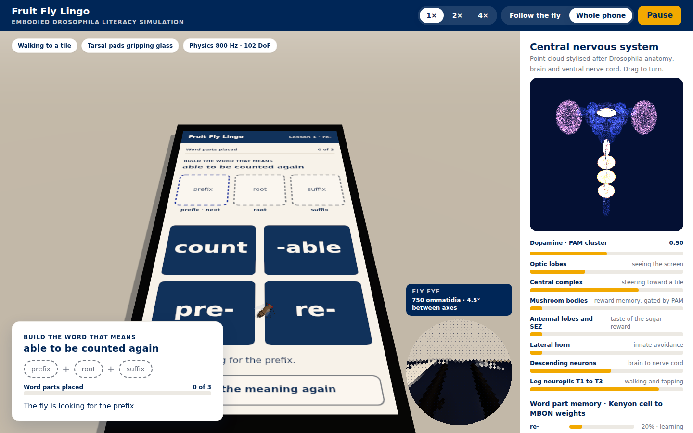 | 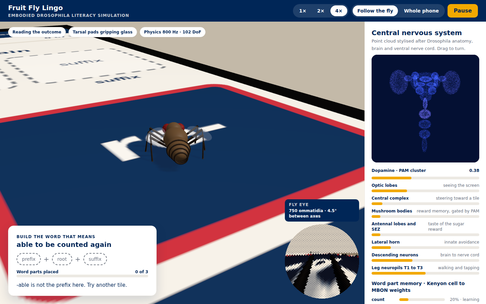 |
| **Whole phone.** The lesson screen is a canvas texture: progress, the meaning to build, three slots, four tiles, a feedback line. Tile pixel rectangles map to world coordinates the fly walks to. | **A wrong tap.** The tile flashes red, the lateral horn and descending neurons fire, the fly flinches, dopamine drops and that word part's memory weakens slightly. |
| 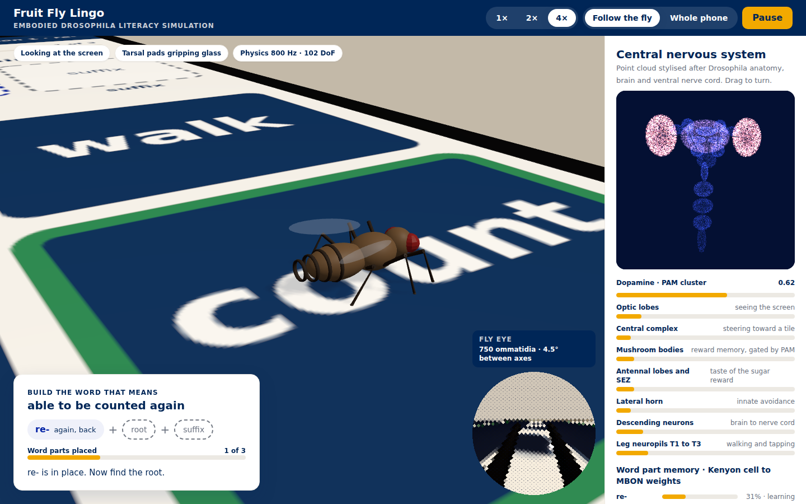 | 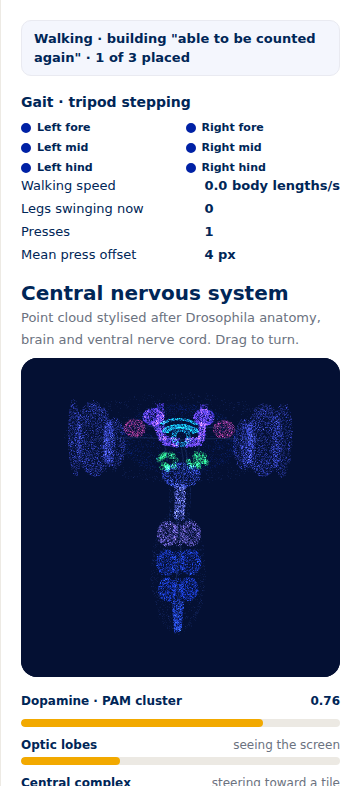 |
| **A correct tap.** `re-` fills the prefix slot, the mushroom bodies and taste centres fire, dopamine rises, the wings buzz, the proboscis extends, and the memory of `re-` strengthens. | **The brain panel.** About 57,000 points shaped after the FlyWire and MaleCNS neuropils: the lamina, medulla, lobula and lobula plate of each optic lobe, mushroom bodies with calyx, peduncle and α and β/γ lobes, the fan-shaped body, ellipsoid body and protocerebral bridge, antennal lobes built from glomeruli, and paired leg neuropils in the nerve cord. Each neuropil has its own resting hue and turns amber as it fires. Every point behaves as a neuron: region activity sets how often it spikes, and each spike shows as a calcium-imaging flash with a fast rise and slow decay. Circuits with known dynamics follow the research: a heading bump circles the ellipsoid body and the protocerebral bridge as the fly turns (Seelig and Jayaraman 2015), optic-flow waves cross the optic lobes while it moves and the lobula plates answer turns, Kenyon cells fire sparsely, a reward sweeps dopamine along the mushroom-body lobe compartments and a punishment lights the α-lobe tip, each reward brings a new odour that lights its own few antennal-lobe glomeruli, and each leg neuropil hemisegment fires with its own leg's swing. **Name the parts** numbers 16 neuropils, as on the poster. Fibre tracts carry travelling pulses; below are a dopamine meter, per-region activity and per-morpheme memory. Drag to turn it. |

The round inset at the bottom right is the **fly-eye view**: a camera mounted on the fly's head, rendered through a hexagonal ommatidia mosaic (about 750 cells, matching the 4.5° inter-ommatidial angle in the TRD). Letters blur into luminance blocks, which is why the fly has to sweep its head to resolve them.

### Controls

- Experiment: 1 Walking, 2 Flying, 3 Touch.
- Show paths / Show landing heatmap: toggles above the arena, kept per experiment.
- Speed 1×, 2×, 4×.
- Camera: follow the fly, or view the whole phone. Drag to orbit, scroll to zoom.
- Pause / Play.
- Reset memory: clears the Kenyon cell to MBON weights and restarts the curriculum.


## The experiments

Switch with the control at the top left of the header. All three share the same curriculum, memory, brain model and fly; what changes is how the fly reaches the screen and what the phone is.

| | |
| --- | --- |
| 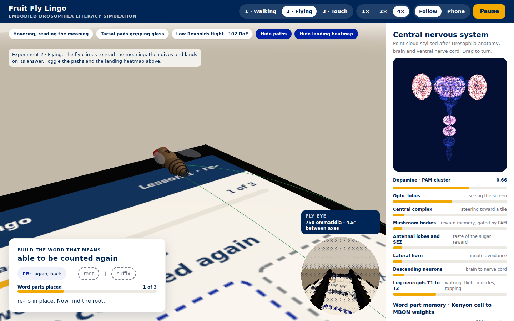 | 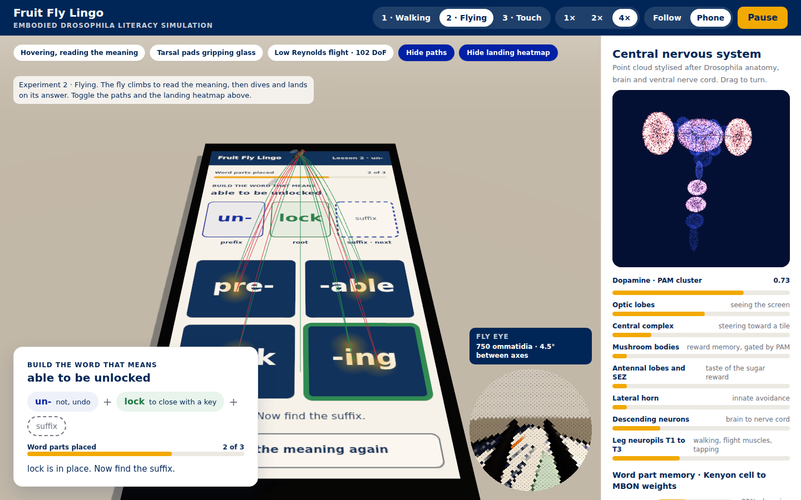 |
| **Experiment 2 · Flying, in the air.** The fly takes off, climbs to a hover point above the meaning and slots, and reads with a head sweep. Wings buzz, legs tuck, the body pitches with the dive. | **Paths and landing heatmap.** Each flight is traced from take-off to landing, green for a correct landing and red for a wrong one. Landings also accumulate as amber heat on the screen, so the distribution of where the fly puts down builds up over trials. Both are toggles above the arena. |
| 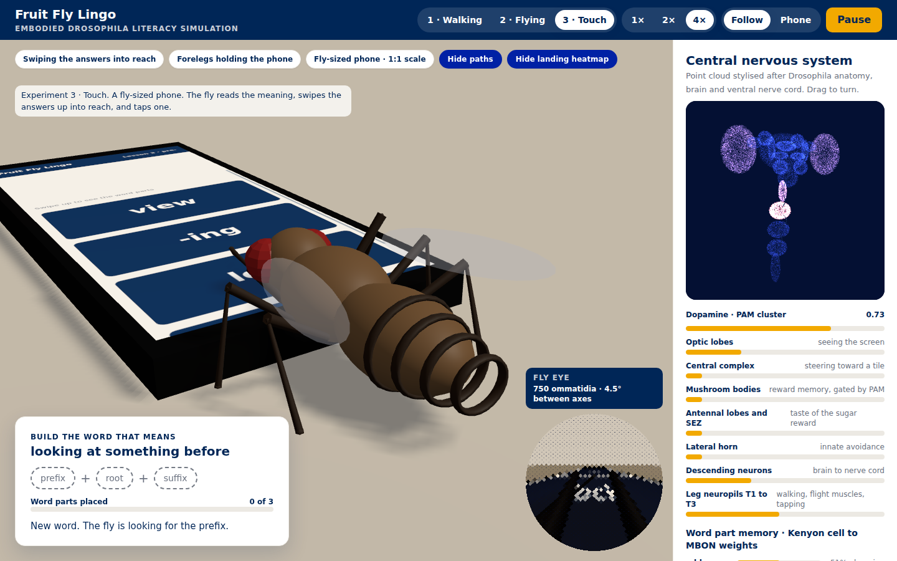 | 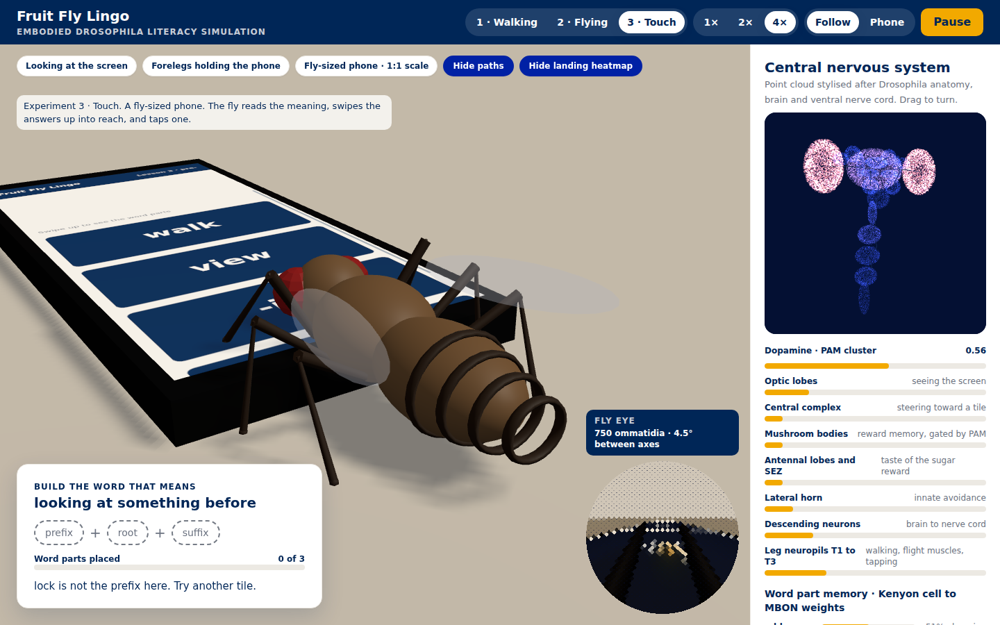 |
| **Experiment 3 · Touch, swiping.** The phone is scaled to the fly (about 1.6 body lengths long). The fly stands at the bottom edge with its forelegs on the glass, the way a person holds a phone. The answers are a single column below the fold, so it reads the meaning at the top, then swipes up with a foreleg to scroll them into reach. | **Tapping.** Once the chosen tile sits under its reach it presses with the nearer foreleg. The scroll position is part of the coordinate mapping, so the tap lands on the tile where it is currently drawn. |

| Experiment | Phone | Reading | Answering | Records |
| --- | --- | --- | --- | --- |
| 1 · Walking | Table-sized, lying flat | Head sweep from where it stands | Walks to the tile, presses with a foreleg | Walking paths, press heatmap |
| 2 · Flying | Table-sized, lying flat | Climbs to a hover point over the prompt | Dives and lands on the tile; landing is the answer | Flight paths, landing heatmap |
| 3 · Touch | Fly-sized, held at the bottom edge | Reads at scroll 0 | Swipes the list, then taps | Press heatmap in content coordinates |
| 4 · Spelling | Real-size laptop with a spelling activity | Hovers in front of the screen | Flies key to key and presses each letter with its body | Letter answers into the same trials, memory and dashboards |
| 5 · Teacher | Fly-sized laptop with a gradebook, trackpad only, no touch | Reads from the trackpad | Steers the cursor with one foreleg on the pad, presses the pad to click, steps over to tap keys | Clicks, misclicks, keystrokes, Fitts' law, cursor heatmap, grading error |
| 6 · District admin | Fly-sized laptop with nine webcam sessions, a vision overlay and FlyAI | Watches the grid | Steers to a flagged tile, opens it, clicks the check-in button | Flags scored against seeded cheating, precision, response time, attention, detections |
| 15 · Geography | A globe with real country outlines on a school desk, and a trivia card | Walks to the card and reads the question | Flies to the globe, sweeps it round with a foreleg, flies to a country and taps it; it lights green or red | Countries right, distance off in km, country memory, rounds of ten |
| 14 · Paper book | A hardback picture book lying open on the table | Flies from word to word above the text, buzzing each word aloud | Grips the page corner with both forelegs, lifts the page with its wings until it falls over | Words per minute and accuracy per page, miscues, seconds to lift each page, vocabulary memory |
| 13 · Scrabble | A 15 by 15 Scrabble board with racks, against a Blue Morpho | Looks over the board and its rack | Walks each tile from its rack to its square and sets it down with a foreleg; the butterfly flies its tiles in | Points per word, wins, words known and learned from the opponent |
| 12 · AR | No screen: a glass AR headset overlays a word frame and holographic blocks on the table | Reads the floating word frame | Walks around the blocks, pinches one with a foreleg, carries it to the frame, rotates it and snaps it into a slot | Blocks right, words built, distance walked, time spent walking around blocks, rotation per block, word part memory |
| 11 · VR | No screen to touch: a VR headset on a ball treadmill, cabled to a laptop that mirrors it; a teacher fly on a second rig teaches the class | Watches the teacher chalk word parts on the board in a virtual third grade class | Looks down at its booklet and writes the answer in pencil; its right foreleg traces the strokes while it walks on an air-supported ball | Answers right, distance walked, turns, where the student looked, word part memory |
| 10 · Writing | Table-sized phone running a cursive writing app | Hovers over the Greek root question | Flies nose-up and writes the answer in cursive with its abdomen tip, then taps Submit | Answers right, legibility, letters per minute, root memory |
| 9 · Reading | Tablet on a stand running an illustrated storybook app | Flies from word to word in front of the page and reads each one aloud as it lights up | Flies up to tap Next, answers Stop & Think questions, taps the next story in the library | Words per minute and accuracy per page, miscues, vocabulary memory, questions right |
| 8 · Phonics | Table-sized phone running a phonics app with a mic | Reads the word, listens to the app say it | Stands on the mic facing the word, holds it down with a foreleg, and sings each sound with one wing | Sounds right per attempt, letter-sound memory, confusion matrix, spectrogram |
| 7 · Classroom | 24 fly-sized tablets on six round tables | Head sweeps over its own tablet, glances at a neighbour's | Taps one of four tiles with a foreleg, twelve items each, between courtship, rejection, rivalry and grooming | Time budget by sex, courtship network, rejections, male courtship drive, lesson completion time in and out of season |

### Spelling

Experiment 4 is a fourth literacy activity. The real-size laptop shows the meaning to spell and the three word-part hints with their glosses, then a row of letter boxes underlined by part. The fly hovers in front of the screen to read, then flies to the key for the next letter and presses it with its whole body. The chance of the right key grows with the memory of the word part the letter belongs to; a wrong choice lands on a neighbouring key, flashes red, and counts as a wrong answer. Each letter is a trial like a tile press, so it feeds the same memory rule, dashboards, and the teacher's roster, where the speller is Fly D.

### Teacher

Experiment 5 turns the study on itself. A teacher fly sits at a fly-sized laptop (smaller than the phone in Experiment 3) running a small learning-management gradebook whose students are Fly A, B, C and D: the walking, flying, touch and spelling flies from Experiments 1 to 4. Their rows are this session's real trials (answers, accuracy, words built, word-part memory), so what the teacher reads is the ongoing study. For each student the teacher reads the gradebook, opens the row, reads the detail page, clicks the grade field, types a grade equal to what it believes the student's accuracy is (it misreads digits less as it practises), presses Enter and clicks Submit; a student with no submission yet is marked Incomplete. When all four are graded a new grading period opens.

The screen is never touched and there is no mouse. The teacher parks at the back of the trackpad and steers the cursor with one foreleg inside a reach window that maps onto the whole screen, so the entire trackpad is covered by moving one leg; a press of the pad is a click, and the movement time of each steer follows the target's index of difficulty. It leaves the pad only to step over to a key, tap it, and walk back.

| | |
| --- | --- |
| 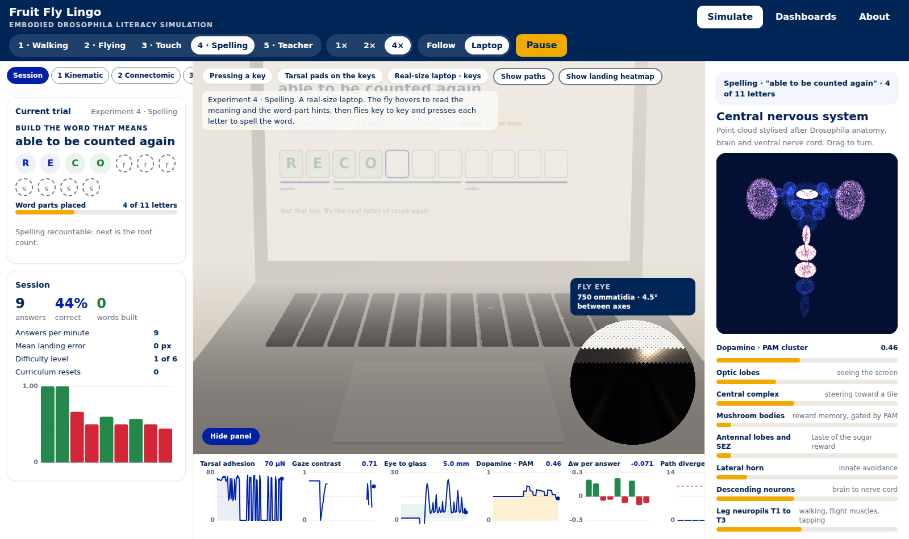 | 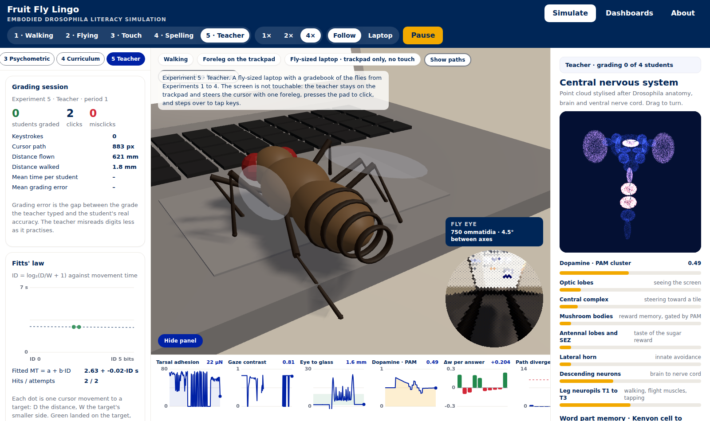 |
| **Experiment 4.** Real-size laptop; the speller on a key with the hints and letter boxes on screen. | **Experiment 5.** Fly-sized laptop; the teacher parked at the back of the trackpad, steering with a foreleg. |

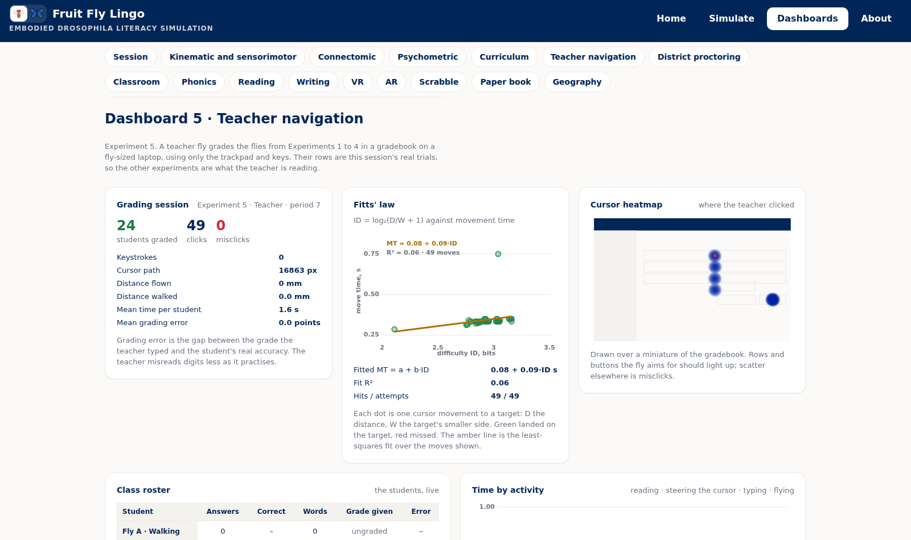

Dashboard 5, Teacher navigation, measures how it navigates: clicks and misclicks (a miss replans), keystrokes, cursor path length, distance flown and walked, time per student, grading error against the student's real accuracy, a Fitts' law scatter of index of difficulty against movement time with a fitted line, a click heatmap over a miniature of the gradebook, the live class roster, and time split between reading, steering, typing and flying.

### District admin

Experiment 6 puts an admin fly at the same fly-sized laptop, trackpad only, in front of a proctoring screen: a 3 × 3 grid of webcam sessions, three each of walking, flying and touch students, each a lightweight simulation with its own phone, answers and behaviour. Three of the nine are seeded each session with a cheating behaviour: looking away from the task, a helper fly in frame, a second device, or answering while off camera. Honest students still glance away now and then.

A computer-vision overlay runs on every tile: a bounding box on the fly with a confidence score, boxes on both forelegs labelled hands, and a dashed gaze ray with an eye-contact badge that turns red when the gaze leaves the student's own screen, plus badges for a second fly, a second device or an off-camera fly. FlyAI, a rule-based assistant in a chat panel, reads that evidence and posts flags with the student's attention and accuracy and a recommendation. The admin watches the grid, steers the cursor to a flagged tile, opens it, and clicks the check-in button; a check-in stops the behaviour for a while.

Dashboard 6, District proctoring, scores the flags against the hidden seeding: confirmed flags and false alarms, precision, cheaters caught, response time from flag to check-in, attention per student (with the seeded names marked in red, which the admin never sees), detection counts over time, and the FlyAI log.

| | |
| --- | --- |
| 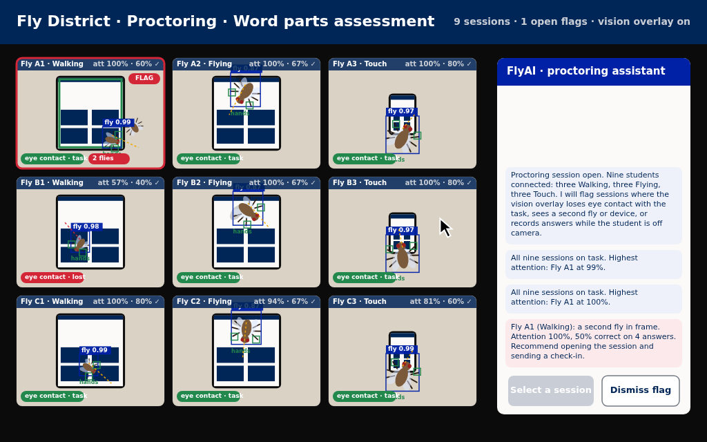 | 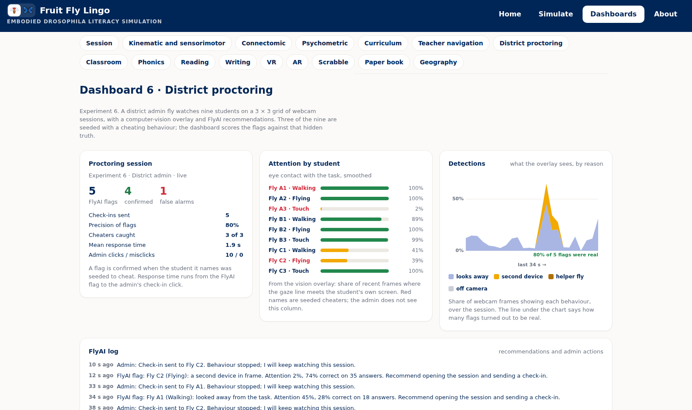 |
| **The proctoring screen.** Boxes on flies and hands, gaze rays, eye-contact badges, a red flag on a suspected tile, FlyAI on the right. | **Dashboard 6.** Flags scored against the seeded truth, attention per student, detections over time. |

### Geography

Experiment 15 is trivia on a globe. The globe stands on a school desk, tilted 23.4° in a brass meridian ring and drawn with real country outlines: Natural Earth at 1:110m, vendored from the world-atlas package as `docs/geo/countries-110m.json` (ISC licence, `docs/geo/LICENSE-world-atlas`) and decoded from TopoJSON in the page. A trivia card on the desk asks one of 49 questions, such as "Machu Picchu sits high in the mountains of which country?".

The fly walks to the card and reads it, flies to the globe and sweeps it round with a foreleg until the region it wants faces it, then flies to the country and taps it. The country lights green if it is right; if it is wrong it lights red, the right country lights green, and the distance between them is measured along the Earth's surface. The chance of choosing the right country is 0.3 + 0.65 × its memory, learned with Δw = η(R − V); a wrong choice is one of the four countries nearest the right one. Questions come in rounds of ten. The Globe camera button frames the globe, and Dashboard 15 keeps countries right, distance off, country memory and every answer.

| | |
| --- | --- |
| 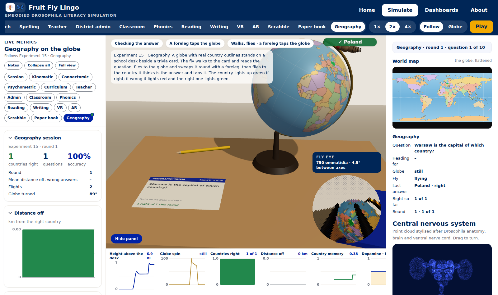 | 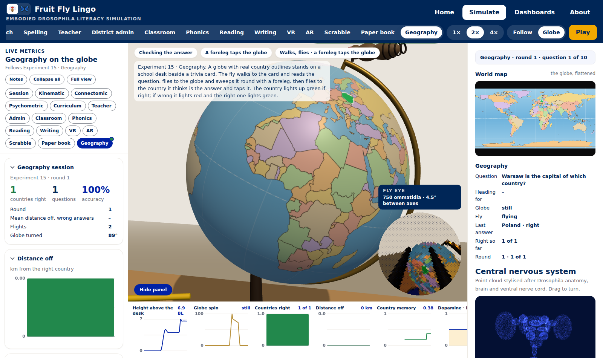 |
| **Trivia on the globe.** The card, the globe and the lit country. | **The globe.** Natural Earth outlines, tilted on its axis. |

### Paper book

Experiment 14 is the Reading story, *Flynn and the Giant Peach*, with the same text and pictures, printed as a hardback picture book lying open on the table: the picture on the left page, the text on the right, the vocabulary in bold. The fly looks over the picture, then flies from word to word above the text, its position a spring chasing each word with a hop onto it, buzzing every word aloud in the same wing voice as Reading and Phonics (the sound pill above the arena turns it off).

At the foot of the page it flies to the outer corner, grips it with both forelegs and beats its wings. The page comes up slowly, the lift wavering with each wingbeat, and curls up from the spine with the corner leading; the next picture shows on its back. Past upright the fly lets go and the page falls over onto the left, the corner now lagging. After the last page and The End, the pages flip back to the beginning and it reads the book again. The Book camera button looks straight down on the spread, and Dashboard 14 keeps pages and words read, words per minute and accuracy by page, miscues and self-corrections, and the seconds each page took to lift.

| | |
| --- | --- |
| 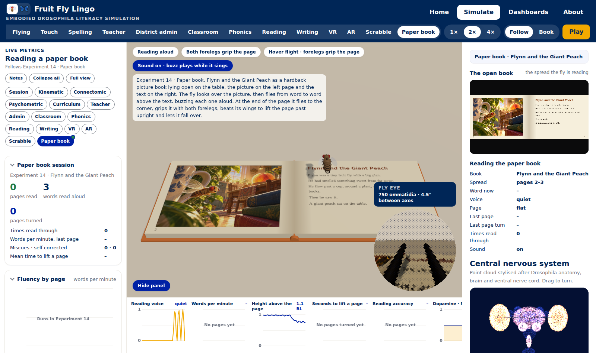 | 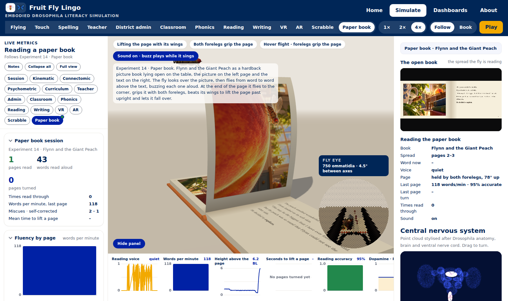 |
| **Reading aloud.** Word by word over the text page. | **Turning the page.** Both forelegs on the corner, wings beating. |

### Scrabble

Experiment 13 is a match: the fruit fly against a Blue Morpho butterfly on a full 15 by 15 board, with the standard premium squares, letter values and a 98-tile bag (no blanks). The first word goes through the centre star; every later word must cross a word already on the board without touching any other, and using all seven tiles scores 50 more. On its turn the fly walks to its rack, takes a tile with a foreleg, walks it to its square and sets it down, one tile at a time, then walks back to its side. The butterfly flies to its rack, picks a tile up, flies it over the board and drops it on its square.

Each player starts knowing the two- and three-letter words and about half of the rest of a 500-word list, and finds every legal placement of the words it knows. It plays its best-scoring word six times in ten and one of its top five otherwise, swaps three tiles when it finds nothing, and learns seven in ten of the words its opponent plays. A game ends when the bag and one rack are empty, or after four passes in a row; racks left over count against their owners. In this experiment the student is always the fruit fly, whatever the header toggle says. The Board camera button looks straight down, and Dashboard 13 keeps wins, points per word, words known and learned, and every word played.

| | |
| --- | --- |
| 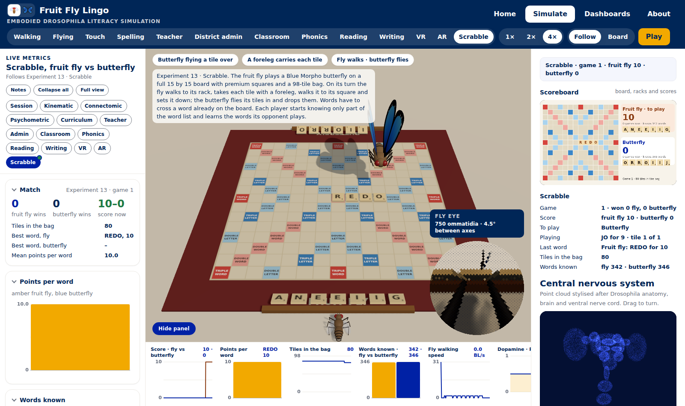 | 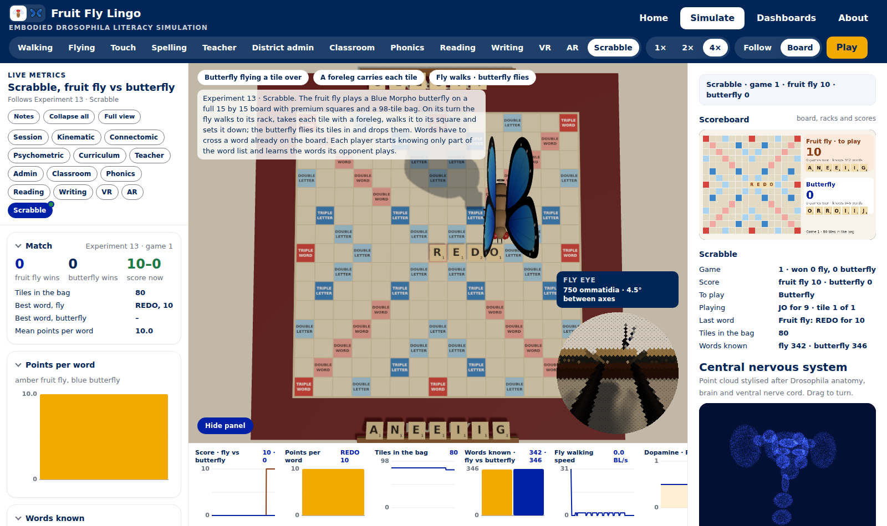 |
| **The match.** The fly walks its tiles in; the butterfly flies them. | **The board.** Premium squares, racks, and the first words. |

### AR

Experiment 12 swaps the screen for mixed reality, and there is no treadmill: the fly really walks, on the table. Its headset is glass, a clear visor over both eyes under a slim frame with a sensor bar and a projector line, and the overlays it draws are part of the scene, so the arena camera sees them too. A spatial grid covers the table. A word frame floats ahead with a meaning to build and three slots, prefix, root and suffix. Six holographic blocks float at head height around the fly, three carrying the word's parts and three carrying parts of other words, each set at a random angle.

The fly reads the frame, picks a block and walks to it, steering around the other blocks, which are obstacles at head height. It points its right foreleg at the block to pinch it, and the headset draws a ray from the foreleg to the block. It carries the block to the frame, then twists it with a circling foreleg until the label faces out, and snaps it in. A right block locks in green and the next slot lights up; a wrong one flashes red and drifts back. The chance of fetching the right block is 0.35 + 0.6 × the memory of the part the slot needs, learned with Δw = η(R − V). The Headset camera button shows the fly's own view through the glass.

Dashboard 12, AR word blocks, shows words built, blocks right, distance walked, time spent walking around blocks, total rotation, rotation per block, word part memory, every placement and a log.

| | |
| --- | --- |
| 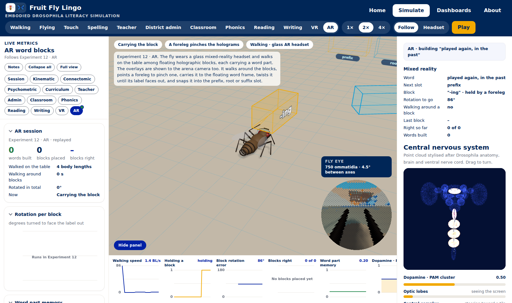 | 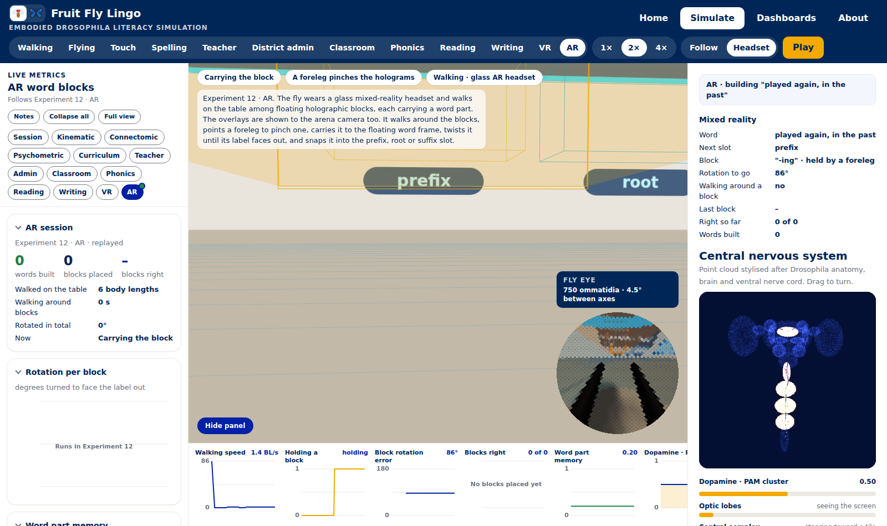 |
| **Mixed reality.** Blocks at head height, the word frame and slots, a foreleg ray. | **Through the headset.** The overlays over the real table. |

### VR

Experiment 11 takes the screen away. The fly wears a headset made for its head: one curved visor wrapped over both compound eyes, with a glossy faceplate, a light strip, a foam gasket and head and top straps. It stands on an air-supported ball, the omnidirectional treadmill used in fly virtual reality rigs, so each step turns the ball instead of moving the fly. A cable runs from the back of the headset up a tether boom and down to a control box, which is also wired to the ball's tracking and to a fly-sized laptop on a stack of books that mirrors the headset.

A teacher fly stands on a second, identical rig, in its own headset, and teaches the same virtual class. While it chalks it steps along the board on its ball, its right foreleg tracing the chalk; then it turns to look across the desks. Its laptop shows the classroom from the teacher's eyes, where the student sits at its desk, and the right panel shows it as an inset in the student's view.

Inside the headset the fly is a student at a desk in a third grade class, with sixteen desks, fidgeting classmates, windows and a teacher at a chalkboard. The teacher chalks one item at a time, either a word to build from its parts (*re + count + able = ?*) or a prefix to define (*pre- means ?*). The student looks down at its open booklet and writes the answer in cursive pencil, using the same Hershey Script letters as Experiment 10, while the fly's right foreleg traces the strokes in small. The teacher marks each answer with a tick or a cross, and after six items the board is erased for a new page. Walking bobs the view, and now and then the fly turns on the ball and the student glances at a classmate.

The chance of a right answer is 0.35 + 0.6 × the memory of the parts on the board, and answers train the same word part memory, with Δw = η(R − V), as the other experiments. Dashboard 11, VR classroom, shows answers right, distance walked on the ball, turns, how long the student looked at the board, the booklet and classmates, word part memory, the booklet's answers and a log.

| | |
| --- | --- |
| 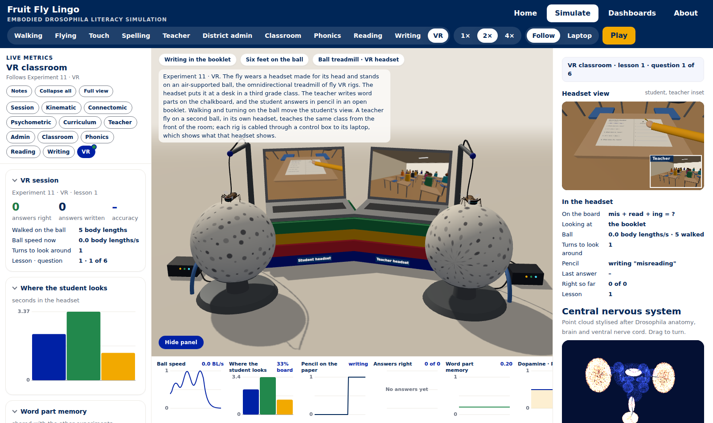 | 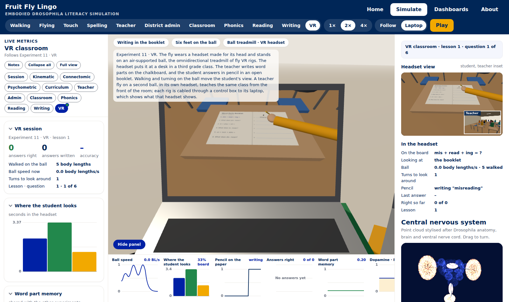 |
| **The rigs.** Student and teacher flies, each with a headset, a ball treadmill, a tether boom, a control box and a laptop mirroring its headset. | **The headset view.** The chalkboard, classmates, the booklet and the pencil. |
| 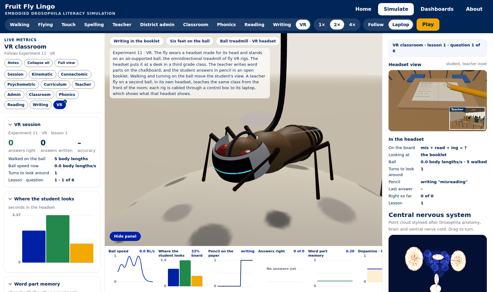 | 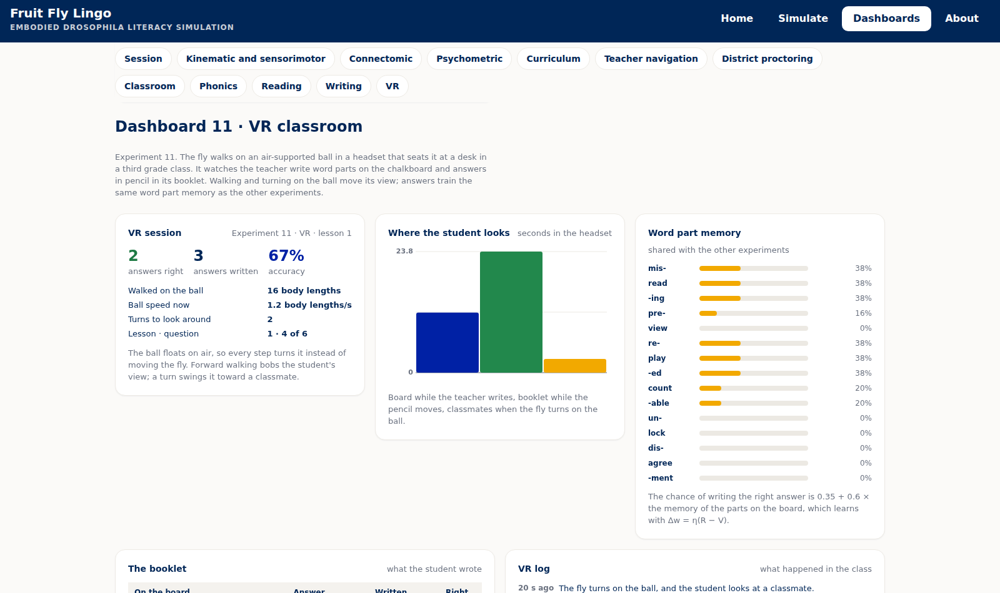 |
| **The headset.** A curved visor over both eyes, faceplate, light strip, straps and cable. | **Dashboard 11.** Answers, distance walked, where the student looked, word part memory, the booklet. |

### Writing

Experiment 10 is a cursive writing app on the table-sized phone. It asks about twelve Greek roots, alternating between "What does the Greek root *bio* mean?" and "Which Greek root means *light*?", with example words such as *biology* and *photograph*, and gives lined handwriting paper, a readout of what the recogniser read, and Clear and Submit buttons.

The fly answers in joined cursive with the tip of its abdomen, while flying. It hovers over the question to read it, then flies down and pitches about 29° nose-up so that its abdomen tip rests on the glass, and follows each letter's stroke at about 90 px a second, laying ink behind it. It lifts the tip to hop to the dot of an *i* or the cross of a *t*. The letter shapes are the Hershey Script 1-stroke font, a public-domain single-stroke font made for pen plotters (via the MIT-licensed `hersheytext` package); only the 26 lowercase glyphs are embedded, about 3 KB. The abdominal ganglion lights up in the brain panel while it writes.

Hovering flight adds a smooth wobble to the line, which shrinks as the fly's tail control improves with each answer. When it taps Submit the recogniser reads the handwriting; very shaky writing, below about 55 % legibility, can turn one letter into another. Whether the answer itself is right depends on a memory per root, learned with Δw = η(R − V); a wrong answer is another root's meaning, another root, or a dropped letter.

Dashboard 10, Writing Greek roots in cursive, shows answers right, legibility and letters per minute per answer, ink laid down, motor skill and wobble, misreads by the recogniser, a memory per root, a table of the roots, and a writing log.

| | |
| --- | --- |
| 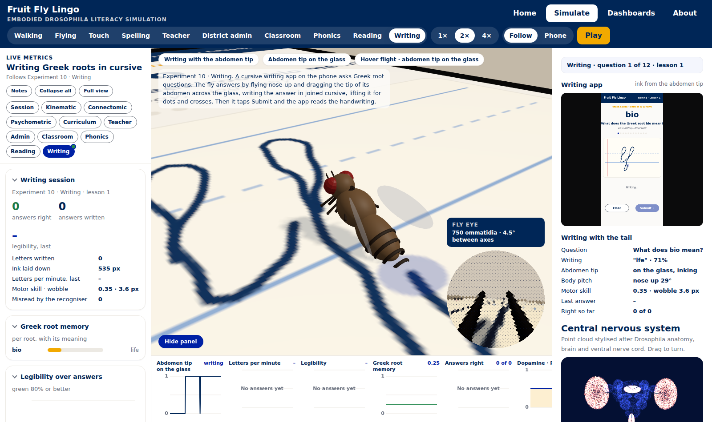 | 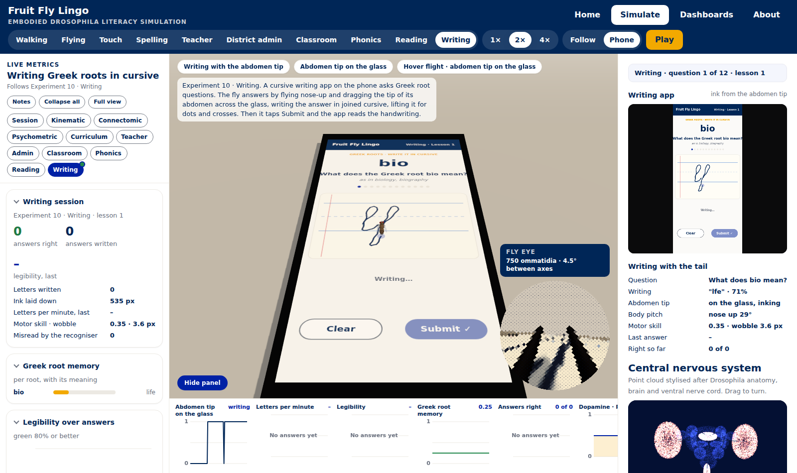 |
| **Writing with the tail.** Nose up, abdomen tip on the glass. | **The writing app.** The question, the handwriting lines, the ink, Submit. |

### Reading

Experiment 9 is a storybook app on a tablet standing in a stand, in the style of illustrated readers such as LitLab. Each spread has a picture on the left and a short passage on the right, with the story's vocabulary in bold and a strip of words to know underneath. A Stop & Think question follows page 3 and a comprehension question follows page 6. The app opens on the library, a grid of all four books; the fly looks them over and taps one, choosing the book it has read least. When a story ends, the library shows the other three and it picks the next.

The fly reads aloud at about 110 words a minute, flying to each word as it reads it. Its position is a spring chasing a point just in front of the current word, so it carries momentum from word to word, overshoots a little, hops onto each new word and swoops back to the start of the next line. The current word lights up as it is read. It reads in the same live wing buzz as the phonics lesson: each word is a hum shaped by its vowels, with a pulse at a stop consonant, a rise at a question and a fall at the end of a sentence. The buzz plays only while it reads. To turn a page it flies up to the Next button and taps it with a foreleg; it answers questions and chooses stories the same way.

Bold vocabulary words are read more slowly and misread more often until their memory grows; most misreadings are self-corrected. Each vocabulary memory learns with Δw = η(R − V). Questions are answered right with a probability that rises with the story's vocabulary memory.

The library has four six-page stories for grades 3 to 5, set in a fruit fly's world where a peach is a mountain and a fan is a storm:

| Story | Theme | Grade | Words to know |
| --- | --- | --- | --- |
| Rosa and the Ripening Banana | Patience, change over time | 3–4 | ripen, patient, fragrance, notice, change |
| Flynn and the Giant Peach | Exploration, problem-solving | 3 | explore, discover, careful, helpful, safely |
| Zig, Zag, and the Wind | Persistence, cause and effect | 3–4 | direction, powerful, predict, protect, return |
| Dot and the Mystery Light | Science, investigation | 4–5 | observe, investigate, evidence, experiment, conclusion |

Every page is illustrated with an AI-generated image made from its prompt; the prompts are collected in [docs/stories/prompts.md](docs/stories/prompts.md). The full-size originals are in `docs/stories` under each story's title, and the app loads web-sized copies named `<story>-p<page>.jpg` (about 140 KB each) that are listed in `docs/stories/manifest.json`. To replace an image, overwrite its copy, or add a new file and list it in the manifest. A page without an image falls back to a painting made in the browser from a scene description.

These books are structured like decodable readers but are not aligned to a phonics scope and sequence. Mapping them to a grade 3 to 5 morphology progression is the next step.

Dashboard 9, Reading stories aloud, shows stories finished, words read, words per minute and accuracy per page, miscues and self-corrections, questions answered, a vocabulary memory per bold word, the library and a reading log.

| | |
| --- | --- |
| 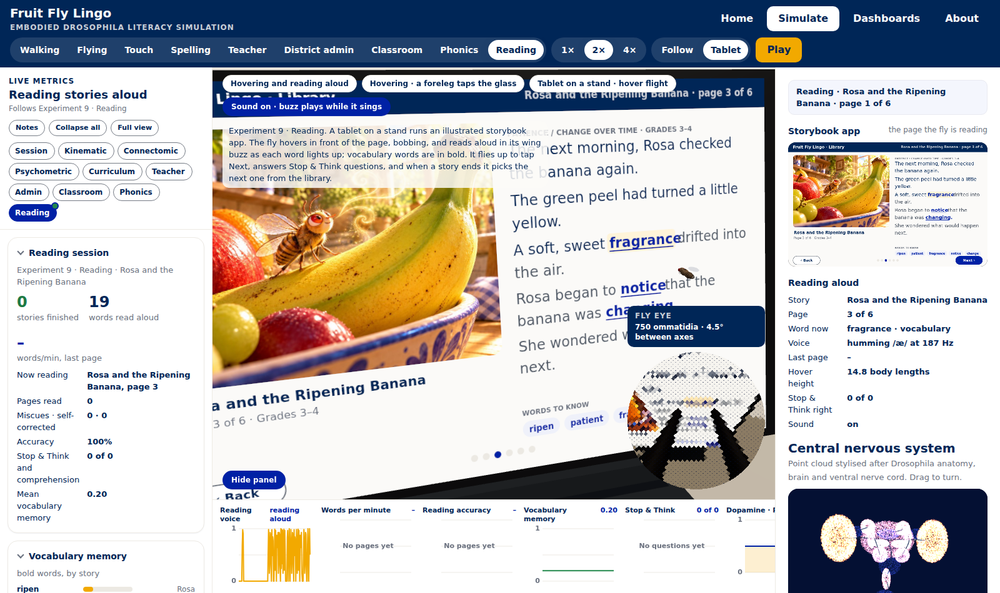 | 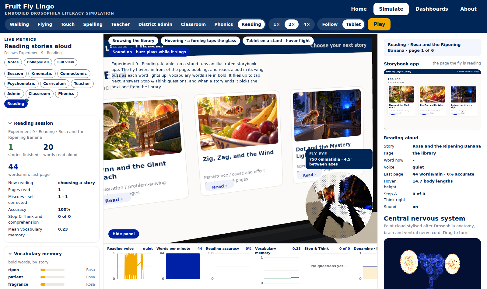 |
| **Reading aloud.** The word being read lights up; bold words are vocabulary. | **The library.** Three more stories after The End. |

### Phonics

Experiment 8 is a phonics lesson on the table-sized phone. The app shows a word split into letter boxes with the sound each spells (c a t, /k/ /æ/ /t/), a hint, a Listen button, a spectrogram panel, a row for what it heard, and a mic button. The fly reads the word and listens while the app plays it (the Listen button animates). The fly stands on the mic button facing up the screen, so the word stays in view while it answers. It presses the mic with a foreleg, holds it down like push-to-talk, and says the word back, its eyes moving across the letter boxes as it goes.

A fly cannot speak, so it sings. Male Drosophila make their courtship song by extending one wing and vibrating it: a pulse song with pulses about 35 ms apart and a sine song humming near 150 Hz. The simulation borrows that. Each sound is buzzed with Web Audio and drawn on the spectrogram from the same model:

- **Stops** (/b d g k p t/): pulse song, three pulses 35 ms apart, band-passed at the consonant's burst frequency.
- **Vowels** (/æ ɛ ɪ ɒ ʌ/): a sawtooth hum at 165 to 205 Hz through two band-pass filters at the vowel's first two formants.
- **Fricatives** (/f s ʃ tʃ h/): noise band-passed around the sound's frequency and fluttered at the wingbeat.
- **Nasals and liquids** (/m n l r/): a low muffled hum, or a gliding one.

In the scene, one wing swings out and vibrates with the sound, and ripples coloured by sound kind spread across the glass. Each sound is right with probability 0.3 + 0.65 × its letter-sound memory. A wrong sound is a plausible confusion (/t/ for /k/, /s/ for /ʃ/, /ɛ/ for /æ/). Each memory learns with Δw = η(R − V). A word gets two attempts; a perfect one earns a dopamine pulse and a celebratory buzz. You hear the buzz while the fly sings, and only then: it is muted between sounds and attempts, when paused, when you switch experiments or views, and when the tab is hidden. The voice is one live synth: a sawtooth wingbeat near 200 Hz, a second wing detuned by under 1 % so the two beat, a wingstroke tremolo, formant filters for vowels, a noise band for fricatives and gated bursts for pulse song. Sound turns on when you open Phonics, since that click lets the browser play audio; the pill above the arena turns it off.

Dashboard 8, Phonics and wing song, shows words said right, sounds right, attempts and retries, a letter-sound memory per phoneme with its accuracy, a confusion matrix of target sounds against heard sounds, the last attempt's spectrogram, and a table of how each kind of sound is sung.

| | |
| --- | --- |
| 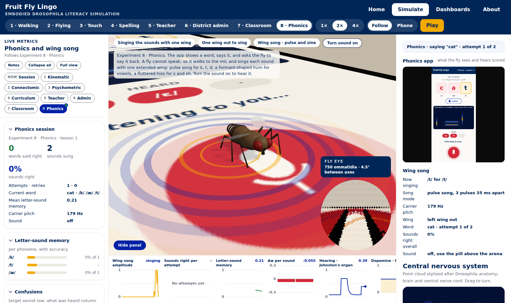 | 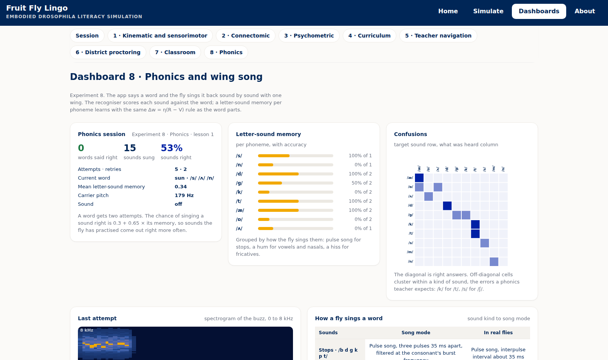 |
| **Singing the word.** One wing out, ripples on the glass, the spectrogram filling on the screen. | **Dashboard 8.** Letter-sound memory, confusions and the last spectrogram. |

### Classroom

Experiment 7 fills a fly-sized classroom: six round tables, four seats each, a tablet in front of every seat, and a whiteboard that tracks the lesson. Twenty-four students, twelve female and twelve male, are seated at random, so some tables are balanced and some are not. The females are drawn larger with a striped, pointed abdomen; the males are smaller, with a dark abdomen tip and sex combs on the forelegs. Every fly has to finish the same twelve word-part items. A lesson ends only when the last fly finishes, then the bell rings and the next lesson starts.

It is mating season, and the flies behave like flies. Each student is a lightweight copy of the procedural fly with its own gait, wings and tapping foreleg, and its own state machine:

- **On task.** It reads its tablet with head sweeps and taps an answer. The chance of a right answer rises with its mastery, learned with the same Δw = η(R − V) rule, and falls when its attention drops.
- **Courtship.** Between items a male may turn toward a female, walk after her (or fly, if she sits at another table), tap her with a foreleg and sing by extending and vibrating one wing.
- **Rejection.** A busy, unreceptive female usually ignores him and keeps tapping, or flicks her wings and kicks, or decamps on a short flight around the room. A female who has finished is more tolerant and may let him stay beside her for a moment. Nothing further happens; he goes back to his tablet.
- **Courtship conditioning.** Each rejection cuts a male's courtship drive by about a third, so the room settles as a lesson goes on. Drive recovers a little between lessons.
- **Rivals.** Two males courting the same female square off with raised wings and lunges, and the loser goes back to his seat.
- **Grooming and glancing.** Flies groom between trials. A fly may glance at a tablemate who is further ahead, which raises the chance that its next answer is right.
- **Co-action.** Attention rises when tablemates are on task and falls when courtship happens at the table or when a male is singing beside you.

Rings under the flies show what each one is doing: blue on task, red courting, pink being courted, amber grooming or glancing, green finished, grey away from the tablet. Dashed red lines join courting pairs, and small badges mark a song, a rejection, a fight or a finished lesson. Toggle that overlay and mating season from the pills above the arena.

With twenty-four flies there is no single fly-eye inset here. Instead, a third pill turns on a computer-vision overlay like the district admin's screen: a bounding box with name and confidence on every fly, its forelegs boxed as hands (filled while tapping), a dashed gaze ray from its head with an eye-contact badge (green on its own tablet, amber on a neighbour's, red when lost to a suitor or rival, grey once done), the last twelve seconds of its path, and a detection summary in the corner.

The camera starts on the whole room; click any fly to follow it and drive the brain panel with its behaviour, which lights the antennal lobes and lateral horn during courtship and the mesothoracic neuropil during song.

Dashboard 7, Classroom social dynamics, shows the class on task, finished and courting, counts of courtship attempts and of each kind of rejection, fights, glances and grooming bouts, a time budget for females and males, the room over time with mean male drive, a courtship network matrix, lesson completion times in and out of season, and a live roster of all 24.

| | |
| --- | --- |
| 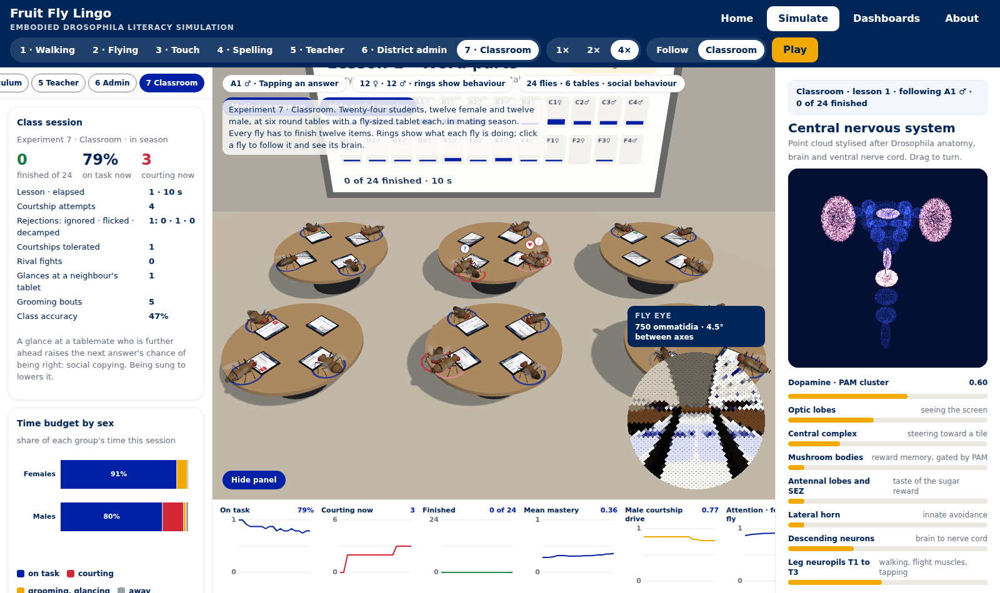 | 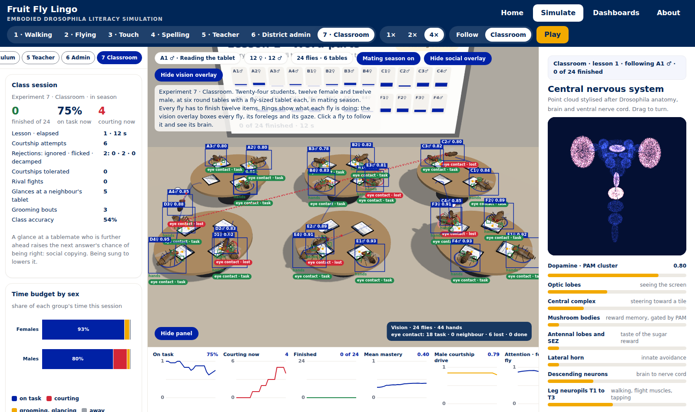 |
| **The classroom.** Twenty-four students at six tables, rings showing behaviour, the whiteboard tracking the lesson. | **Vision overlay.** Boxes and confidence, hands, gaze rays with eye-contact badges, and trails. |
| 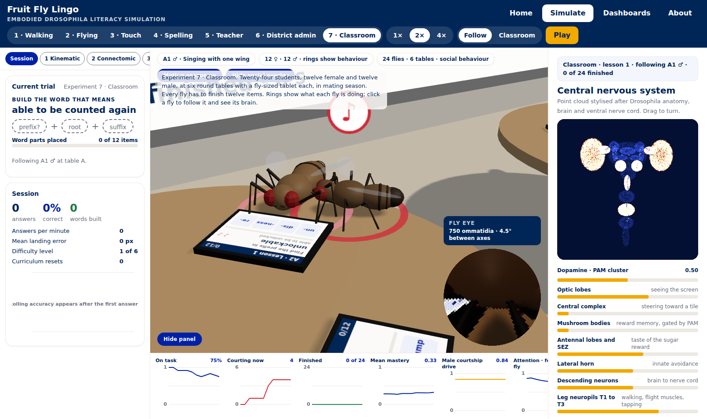 | 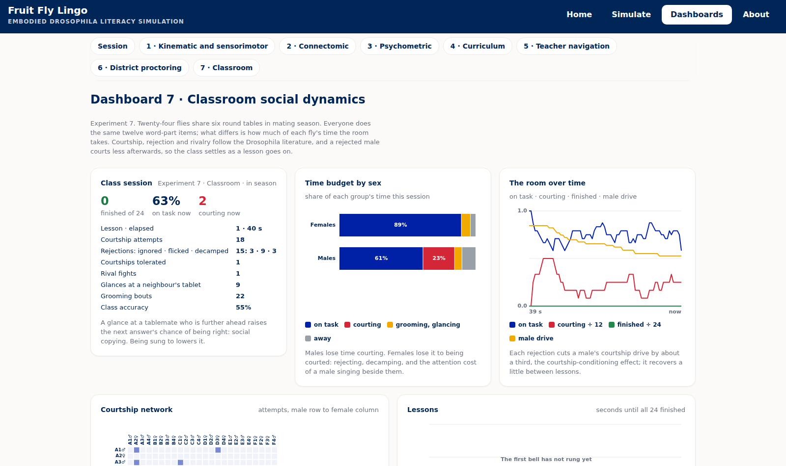 |
| **Courtship at a tablet.** He has tapped her and sings with one wing while she keeps working. | **Dashboard 7.** Time budget by sex, courtship and rejection counts, the room over time, the courtship network. |

The landing scatter is deliberate: each answer is aimed at the tile centre plus a small normal error (about 6 px walking, 14 px flying, 8 px touch on the 390 px wide screen), which is what makes the heatmap informative rather than a set of points.

## Software architecture

The whole application lives in `index.html`. The diagram groups it by responsibility; arrows are data or control flow at run time.


```mermaid
flowchart TB
  subgraph Browser["Browser · index.html"]
    direction TB

    subgraph UI["HUD · HTML + CSS (UF design tokens)"]
      Header["Header controls<br/>experiment · speed · camera · pause"]
      TrialCard["Trial card<br/>meaning · placed chips · progress · feedback"]
      StatePills["State pills<br/>phase · adhesion · physics"]
      BrainHUD["Brain panel HUD<br/>dopamine · region bars · memory · stats"]
      EyeLabel["Fly-eye label"]
    end

    subgraph Game["Curriculum and game state"]
      WORDS["WORDS[]<br/>word · meaning · parts · glosses"]
      Distractors["DISTRACTORS[]"]
      GameState["game<br/>wordIdx · placed · tiles · flash<br/>memory Map · dopamine · taps · correct"]
      buildTiles["buildTiles()<br/>remaining parts + distractors, shuffled"]
      registerTap["registerTap(i)<br/>correct → memory↑ dopamine↑ placed++<br/>wrong → memory↓ dopamine↓ flinch"]
      nextWord["nextWord()"]
    end

    subgraph Screen["Phone screen"]
      ScreenCanvas["2D canvas 390×844<br/>drawScreen(): grid layout, or scrolling list for Touch"]
      ScreenTex["THREE.CanvasTexture<br/>map + emissiveMap on the screen plane"]
      pxToWorld["pxToWorld(px, py)<br/>content px → phone local → world, through phone scale"]
    end

    subgraph Agent["Agent · state machine (stepAgent), one path per experiment"]
      Look["look<br/>head sweep · optic lobes"]
      Walk["1 walk<br/>steer to stand point · gait · CX, DN, T1–T3"]
      Takeoff["2 takeoff → hover<br/>climb over the prompt, read"]
      Dive["2 dive → land<br/>bezier to the tile, landing = answer"]
      Scroll["3 scroll<br/>foreleg swipes move scrollY"]
      Tap["tap<br/>foreleg reach · press · return"]
      React["react"]
      Celebrate["celebrate<br/>word complete"]
      chooseTile["chooseTile()<br/>P(correct) = 0.35 + 0.6 · memory"]
      pickTarget["pickTarget()<br/>tile centre + normal scatter"]
      Look --> Walk --> Tap
      Look --> Takeoff --> Dive --> React
      Look --> Scroll --> Tap
      Tap --> React --> Look
      Tap --> Celebrate --> Look
      Dive --> Celebrate
    end

    subgraph Records["Trajectories and heatmap"]
      Traj["trajGroups[exp]<br/>THREE.Line per trial, green or red"]
      Heat["heat[exp] canvas<br/>radial blobs at landing px, drawn into the screen"]
      Toggles["Show paths · Show landing heatmap"]
    end

    subgraph Fly["Procedural fly (animateFly)"]
      Body["body group<br/>thorax · abdomen · head · eyes · antennae"]
      Wings["wings<br/>buzz on reward"]
      Proboscis["proboscis<br/>extends on reward"]
      Legs["6 legs · femur + tibia<br/>world-space feet · tripod stepping"]
      IK["solveLeg()<br/>two-bone analytic IK"]
      FlyState["flyState<br/>pos · yaw · headYaw · buzz · flinch · gaitPhase"]
    end

    subgraph Brain["Brain activity model"]
      Regions["REGIONS[16]<br/>optic L/R · central · MB L/R · CX · AL L/R<br/>LH L/R · SEZ · DN · T1 · T2 · T3 · ABD"]
      Act["act[16] Float32Array<br/>pulse(i, v) · exponential decay"]
      PointCloud["Points ~55k<br/>ShaderMaterial: region → act[] → colour, size"]
      Fibres["FIBRES[14] CatmullRom tracts<br/>pulse particles gated by source activity"]
      Groups["GROUPS[7]<br/>anatomical labels for the HUD"]
    end

    subgraph Render["Rendering · three.js r160"]
      MainScene["Main scene<br/>table · phone · glass · fly · lights · shadows"]
      MainCam["Perspective camera + OrbitControls<br/>follow / phone modes"]
      EyeCam["Eye camera on the head<br/>fov 140"]
      EyeRT["WebGLRenderTarget 256²"]
      EyeShader["Ommatidia shader quad<br/>hex nearest-centre sampling"]
      BrainScene["Brain scene · second renderer<br/>OrbitControls autoRotate"]
      Loop["frame()<br/>dt = raw · speed, substepped at 25 ms"]
    end
  end

  CDN["cdn.jsdelivr.net<br/>three.module.js · OrbitControls.js"] -.import map.-> Render

  Header -->|speed, camera, play| Loop
  Header -->|set camera mode| MainCam
  BrainHUD -->|reset| GameState

  WORDS --> buildTiles --> GameState
  Distractors --> buildTiles
  GameState --> ScreenCanvas --> ScreenTex --> MainScene
  GameState --> TrialCard
  GameState --> BrainHUD

  Loop --> Agent
  Loop --> Fly
  Loop -->|decay| Act
  Loop --> MainCam
  chooseTile --> pickTarget
  GameState --> chooseTile
  pickTarget --> pxToWorld
  pxToWorld --> FlyState
  Walk -->|record positions| Traj
  Dive -->|record positions| Traj
  registerTap -->|landing px| Heat
  Heat --> ScreenCanvas
  Toggles --> Traj
  Toggles --> Heat
  Traj --> MainScene
  Agent -->|pulse| Act
  Agent -->|phase| StatePills
  Tap -->|foot reaches tile| Legs
  Tap --> registerTap --> GameState
  registerTap -->|pulse| Act
  registerTap -->|buzz, proboscis, flinch| FlyState
  Celebrate --> nextWord --> GameState

  FlyState --> Body
  FlyState --> Wings
  FlyState --> Proboscis
  Legs --> IK --> MainScene
  Body --> EyeCam

  Regions --> PointCloud
  Regions --> Fibres
  Act --> PointCloud
  Act --> Fibres
  Act --> Groups --> BrainHUD
  PointCloud --> BrainScene
  Fibres --> BrainScene

  MainScene --> MainCam --> Loop
  MainScene --> EyeCam --> EyeRT --> EyeShader -->|scissor viewport| Loop
  BrainScene --> Loop
```

### Agent state machine

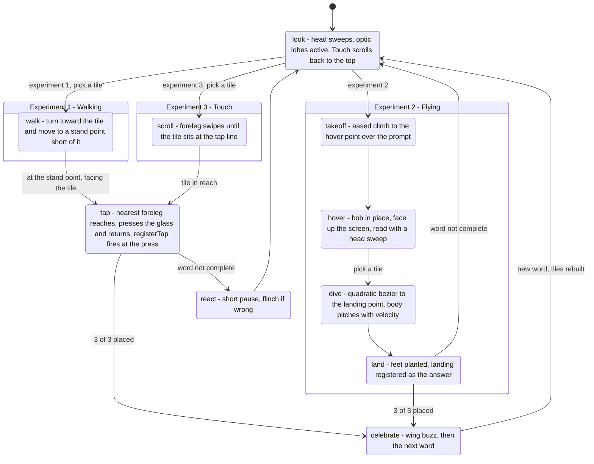
```mermaid
stateDiagram-v2
  [*] --> look
  look: look - head sweeps, optic lobes active, Touch scrolls back to the top
  state "Experiment 1 - Walking" as E1 {
    walk: walk - turn toward the tile and move to a stand point short of it
  }
  state "Experiment 2 - Flying" as E2 {
    takeoff: takeoff - eased climb to the hover point over the prompt
    hover: hover - bob in place, face up the screen, read with a head sweep
    dive: dive - quadratic bezier to the landing point, body pitches with velocity
    land: land - feet planted, landing registered as the answer
    takeoff --> hover
    hover --> dive: pick a tile
    dive --> land
  }
  state "Experiment 3 - Touch" as E3 {
    scroll: scroll - foreleg swipes until the tile sits at the tap line
  }
  tap: tap - nearest foreleg reaches, presses the glass and returns, registerTap fires at the press
  react: react - short pause, flinch if wrong
  celebrate: celebrate - wing buzz, then the next word

  look --> walk: experiment 1, pick a tile
  look --> takeoff: experiment 2
  look --> scroll: experiment 3, pick a tile
  walk --> tap: at the stand point, facing the tile
  scroll --> tap: tile in reach
  tap --> react: word not complete
  tap --> celebrate: 3 of 3 placed
  land --> look: word not complete
  land --> celebrate: 3 of 3 placed
  react --> look
  celebrate --> look: new word, tiles rebuilt
```

### One answer, end to end (Experiment 1 shown; a landing in Experiment 2 and a tap in Experiment 3 join at registerTap)

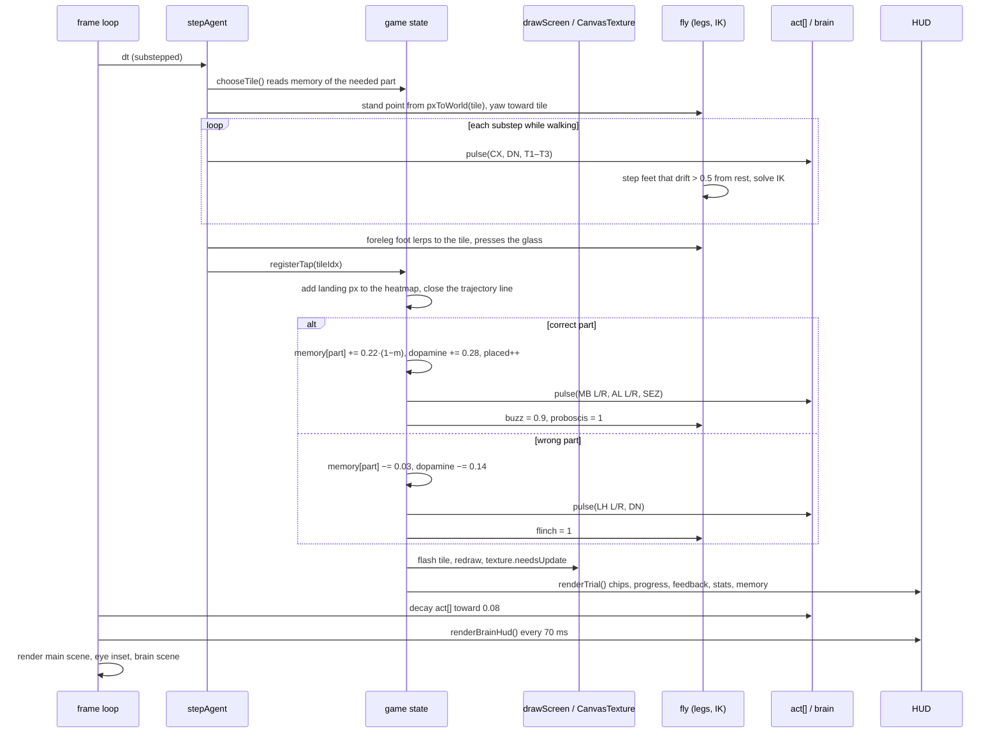
```mermaid
sequenceDiagram
  participant L as frame loop
  participant A as stepAgent
  participant G as game state
  participant S as drawScreen / CanvasTexture
  participant F as fly (legs, IK)
  participant B as act[] / brain
  participant H as HUD

  L->>A: dt (substepped)
  A->>G: chooseTile() reads memory of the needed part
  A->>F: stand point from pxToWorld(tile), yaw toward tile
  loop each substep while walking
    A->>B: pulse(CX, DN, T1–T3)
    F->>F: step feet that drift > 0.5 from rest, solve IK
  end
  A->>F: foreleg foot lerps to the tile, presses the glass
  A->>G: registerTap(tileIdx)
  G->>G: add landing px to the heatmap, close the trajectory line
  alt correct part
    G->>G: memory[part] += 0.22·(1−m), dopamine += 0.28, placed++
    G->>B: pulse(MB L/R, AL L/R, SEZ)
    G->>F: buzz = 0.9, proboscis = 1
  else wrong part
    G->>G: memory[part] −= 0.03, dopamine −= 0.14
    G->>B: pulse(LH L/R, DN)
    G->>F: flinch = 1
  end
  G->>S: flash tile, redraw, texture.needsUpdate
  G->>H: renderTrial() chips, progress, feedback, stats, memory
  L->>B: decay act[] toward 0.08
  L->>H: renderBrainHud() every 70 ms
  L->>L: render main scene, eye inset, brain scene
```

## Where this sits in the EDLS

The TRD describes a biologically grounded stack: a MuJoCo `flybody` model (102 DoF, 59 torque channels) driven by a connectome-derived controller (FlyGM on MaleCNS v1.0), with xAPI telemetry flowing through a Science DMZ to a Learning Record Store for G-DINA, Half-Life Regression and Rasch evaluation. This repository implements the interaction layer and a behavioural stand-in for the rest, so the game, camera work, fly-eye optics and brain visualisation can be designed and tested before the heavy components exist.

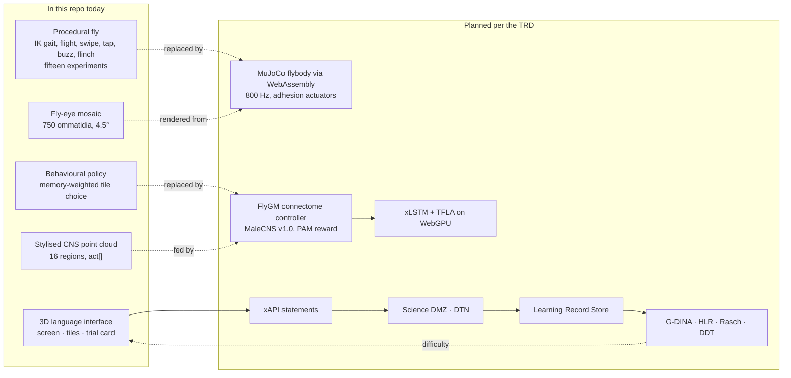
```mermaid
flowchart LR
  subgraph Now["In this repo today"]
    UI["3D language interface<br/>screen · tiles · trial card"]
    FlyP["Procedural fly<br/>IK gait, flight, swipe, tap, buzz, flinch<br/>fifteen experiments"]
    Policy["Behavioural policy<br/>memory-weighted tile choice"]
    BrainViz["Stylised CNS point cloud<br/>16 regions, act[]"]
    Eye["Fly-eye mosaic<br/>750 ommatidia, 4.5°"]
  end
  subgraph Planned["Planned per the TRD"]
    MuJoCo["MuJoCo flybody via WebAssembly<br/>800 Hz, adhesion actuators"]
    FlyGM["FlyGM connectome controller<br/>MaleCNS v1.0, PAM reward"]
    xLSTM["xLSTM + TFLA on WebGPU"]
    xAPI["xAPI statements"]
    DMZ["Science DMZ · DTN"]
    LRS["Learning Record Store"]
    Eval["G-DINA · HLR · Rasch · DDT"]
  end
  Policy -. replaced by .-> FlyGM
  FlyP -. replaced by .-> MuJoCo
  BrainViz -. fed by .-> FlyGM
  Eye -. rendered from .-> MuJoCo
  UI --> xAPI --> DMZ --> LRS --> Eval
  Eval -. difficulty .-> UI
  FlyGM --> xLSTM
```

## Design system

Styling uses a University of Florida palette: core blue for actions, dark blue for chrome and text, alachua for work in flight, gator green for mastery, and bottlebrush red only for errors. Headings and controls are set in Neulis Sans and running text in Liebling, both with system fallbacks. The phone screen, the laptop screens and the HUD share the same tokens.

## Files

```
index.html            the whole app: three views, three.js scene, agent, brain, telemetry, dashboards, about
vercel.json           static deployment settings
README.md
docs/screenshots/     images used above
docs/research/        the five research PDFs, the dashboard specification, and rendered page images
```
